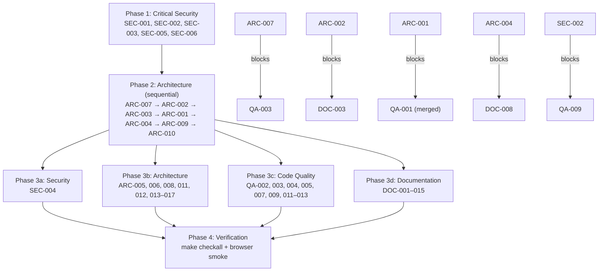

# Project Audit Report

> **Project**: `@paulrobello/webllm` — browser-side LLM inference over WebGPU
> **Date**: 2026-07-14
> **Commit**: `eccf6e6` (main, clean tree)
> **Stack**: TypeScript (Bun tooling), Emscripten/C++ WASM (patched llama.cpp `ggml-webgpu`), WGSL, browser JS harnesses, Bun + SQLite dashboard, Python helper scripts
> **Audited by**: Claude Code Audit System (four Fable subagents: architecture, security, code quality, documentation; par-mem graph-assisted at index HEAD `eccf6e6`, stale: false)

---

## Executive Summary

The project is in **good health**: the ship gate (`make checkall`) is verified green (782 tests pass / 36 skip, 39,312 assertions in 6.3s), the shipped `src/` library surface has no security findings, runtime dependencies are zero, and the evidence-driven workflow (probe-first doctrine, parity gates, regression-lessons list) is a genuine structural strength. The most urgent single fix is `log_receiver.py` — an unauthenticated, all-interfaces HTTP endpoint with a path-traversal arbitrary file write (delete it or lock it down). The largest engineering liability is `src/inference/model-inference.ts`: a 4,383-line class carrying five-to-six near-duplicate ~400-line transformer graph builders, where every architecture or mask fix is a multi-site edit whose divergence only the manual browser smoke run can catch. The most misleading surfaces for humans are `docs/MODEL_SUPPORT.md` (three months stale, documents shipped features as missing) and a README Quick Start that no longer compiles; the repo also ships with no LICENSE file despite MIT declarations. Remediating the critical + high tier is dominated by two large refactors (graph-builder consolidation, engine-state consolidation); everything else is small and mechanical.

### Issue Count by Severity

| Severity | Architecture | Security | Code Quality | Documentation | Total |
|----------|:-----------:|:--------:|:------------:|:-------------:|:-----:|
| 🔴 Critical | 0 | 1 | 0 | 2 | **3** |
| 🟠 High     | 5 | 1 | 4 | 4 | **14** |
| 🟡 Medium   | 7 | 2 | 5 | 5 | **19** |
| 🔵 Low      | 5 | 3 | 4 | 4 | **16** |
| **Total**   | **17** | **7** | **13** | **15** | **52** |

**Cross-domain duplicates** (found independently by two agents; count once when planning work): QA-001 ≡ ARC-001, QA-006 ≡ ARC-009, QA-008 ≡ ARC-011, QA-010 ≡ ARC-004 (subset), QA-005 ≈ ARC-010, QA-009 ≈ ARC-008 + SEC-003 (overlapping remedies on `eval/live-server.ts`).

---

## 🔴 Critical Issues (Resolve Immediately)

### [SEC-001] Unauthenticated arbitrary file write via path traversal in `log_receiver.py`
- **Area**: Security
- **Location**: `log_receiver.py:5-14` (entire file)
- **Description**: `do_POST` computes `name = self.path.lstrip('/')` with no sanitization and writes the raw request body to `open(f"eval/reports/p2-v2-option-a-prime-2026-05-06/{name}", "wb")`. Literal `..` sequences escape the target directory. The server binds to **all interfaces** (`socketserver.TCPServer(("", 8032), ...)`) and, because it subclasses `SimpleHTTPRequestHandler`, its inherited GET handler serves the entire repo working directory to the network. Missing `content-length` also throws an unhandled 500.
- **Impact**: On any shared network, `curl -X POST --data-binary @payload http://<victim-ip>:8032/../../../../Users/probello/.zshrc` overwrites arbitrary files with attacker bytes — a path from unauthenticated network request to local code execution. Mitigating factor: it is a hand-run throwaway probe sink for one 2026-05-06 report, not part of any `make` target.
- **Remedy**: Delete the file (the probe it served is closed). If kept: bind `127.0.0.1`, `os.path.basename` the name, realpath-containment check, guard missing/oversized content-length.

### [DOC-001] LICENSE file missing despite MIT declaration
- **Area**: Documentation
- **Location**: Missing at repo root; referenced by `README.md:3` badge and License section; `package.json` declares `"license": "MIT"`
- **Description**: The README's MIT badge links to `LICENSE`, which does not exist (the repo's only broken doc link, confirmed via `find_broken_doc_links`). The npm package (`"files": ["dist"]`) would publish with no license text.
- **Impact**: Legal consumers cannot verify license terms; many organizations block dependencies without a license file.
- **Remedy**: Add a standard MIT `LICENSE` at root (copyright Paul Robello). npm includes root LICENSE automatically.

### [DOC-002] `docs/MODEL_SUPPORT.md` is ~3 months stale and documents shipped features as missing
- **Area**: Documentation
- **Location**: `docs/MODEL_SUPPORT.md` (last commit 2026-04-24)
- **Description**: The designated contributor guide is wrong on at least five load-bearing claims: (1) says 14 models registered — 30 are; (2) lists `mistral` as "declared only, untested" — Mistral-7B is in the canonical 6-model ship-gate fleet; (3) says i-quants "will fail at weight load" — `iq3m` is a first-class QuantFormat with two canonical IQ3_M fleet members; (4) describes the encoder/embedding path as unimplemented — `src/inference/encoder-inference.ts` and `causal-embedder-inference.ts` shipped with G3 parity verified 2026-07-14; (5) lists Gemma 2 only — Gemma 4 E2B closed 2026-05-12.
- **Impact**: A contributor following it would re-implement shipped features, wrongly conclude IQ3_M models cannot run, and mistrust the model list. Directly contradicts README.md, docs/BENCHMARKS.md, and CLAUDE.md.
- **Remedy**: Full accuracy pass against `eval/models.ts`, `src/core/types.ts`, `src/inference/`; rewrite the encoder section as shipped behavior; replace the hardcoded model table with a pointer to `make bench-eval-models` to prevent recurrence.

---

## 🟠 High Priority Issues

### [ARC-001] `ModelInference` god class with six near-duplicate forward-pass graph builders *(≡ QA-001)*
- **Area**: Architecture / Code Quality
- **Location**: `src/inference/model-inference.ts` (4,383 lines; class spans 424–4383): `forwardSingle` :1479 (CC 50), `forwardForEmbedding` :1954, `forwardWithLayerTaps` :2207 (CC 69), `forwardAllPositions` :2858 (CC 49), `forwardDecode` :3237 (CC 66), `debugLayerOutput` :3945 (CC 46)
- **Description**: Each method re-implements the same ~400-line graph construction: identical `graphMem` sizing, an identical locally-redeclared `padTo` lambda (5 copies: :1523, :1981, :2258, :2885, :3266), identical causal/SWA mask construction, identical QKV → RoPE → KV-cache layer loops. Correction comments are duplicated verbatim across copies, proving fixes are already applied N times. Shared builders (`buildQKV`, `applyRope`, `buildFFNGateUp`, `writeCausalMaskF16`) exist — the extraction stopped halfway. Five of the repo's top-ten complexity scores live here; its `GgmlWasm` dependency is the graph's #1 articulation point (in-degree 120).
- **Impact**: Architecture-family fixes (RoPE modes, Gemma soft-cap, SWA masks, PLE injection) must be applied N times; a fix landing in 4 of 5 sites is a silent parity bug only the browser smoke run can catch — the project's own documented top hazard class.
- **Remedy**: Extract a single mode-parameterized graph builder (prefill / decode / embedding / taps / verify as option flags over one loop body), one shared `padTo`, and a `ModelInferenceDiagnostics` module for the `debug*` methods. Gate with `tests/forward-verify-equivalence.test.ts`-style parity plus a browser `make smoke-bench` parity run (Bun tests cannot exercise the GPU path).

### [ARC-002] Inert orchestration subsystems shipped as public API and documented as load-bearing
- **Area**: Architecture
- **Location**: `src/core/memory-pool.ts`, `src/core/scheduler.ts`, `src/core/pipeline-cache.ts`, `src/core/game-loop.ts`, `src/inference/stream-router.ts`, `src/models/kv-cache.ts`, `README.md:113-166`, `src/core/types.ts:17`
- **Description**: Verified by grep: `MemoryPool.allocate()` has zero production callers — `usedBytes` stays 0 forever, so `ModelManager.canLoad` always passes and pressure/eviction events can never fire, yet `WebLLMConfig.memoryBudget` is a **required** config field feeding it. `Scheduler` is constructed and only ever `.clear()`ed (`engine.ts:1885`). Core `PipelineCache` is constructed, never read or written. `StreamRouter` and `GameLoop` are export-only. `KVCache` on `ModelEntry` is bookkeeping that is only `.reset()` — real KV state lives WASM-side. README presents all of these as the live orchestration layer.
- **Impact**: The load-bearing use case (agent + Three.js on a 16 GB floor) has **no functioning memory-budget enforcement** despite config and docs claiming it; consumers integrate against dead API.
- **Remedy**: Per module: wire it (MemoryPool recording model-weight + KV allocations in `_buildInferenceAndRegister` is small and high-value given the hardware-floor doctrine) or remove from `src/index.ts` and README. Making `memoryBudget` optional-or-functional is the priority.

### [ARC-003] Public API surface exports the entire internals
- **Area**: Architecture
- **Location**: `src/index.ts`
- **Description**: The package root exports ~40 value symbols including deep internals: `ModelInference`, `GgmlWasm`, `GgufParser`, `InferenceSession`, `Sampler`, `Generator`, `LightweightModel`, plus `detectChatTemplate`/`encodeChatPrompt` which the file's own comment admits are internal (exported only for the smoke harness). No tiering between consumer API and engine internals.
- **Impact**: Every internal refactor (including ARC-001) is a public breaking change under semver; the smoke harness's needs dictate the npm contract.
- **Remedy**: Shrink root export to `WebLLM` + types + errors + sampling profiles; add an `"./internal"` subpath in `package.json#exports` for the harness (the `./persistence` subpath already demonstrates the pattern).

### [ARC-004] `WebLLM` facade concentration: seven parallel per-model Maps and a hand-mirrored worker proxy *(⊇ QA-010)*
- **Area**: Architecture
- **Location**: `src/core/engine.ts` (1,888 lines; state maps :217-228; `unloadModel` :319-343; `chatCompletionWithConversation` :842-1195, CC 44; proxy cast :278), `src/core/webllm-proxy.ts`
- **Description**: Per-model state is spread across seven parallel `Map<string, …>` fields plus `ModelManager.models` plus `ConversationPool`; `unloadModel` must enumerate them all by hand. The facade implements the full model-loading pipeline itself rather than delegating to `ModelLoader`. Worker mode returns `WebLLMProxy.init(config) as unknown as Promise<WebLLM>` — the proxy mirrors the surface structurally with no compile-time link (drift caught only by a runtime surface test).
- **Impact**: Load/unload consistency is convention-enforced across nine containers (a missed map = leak or stale dispatch); proxy/engine drift is invisible to the compiler.
- **Remedy**: Single `ModelRecord` aggregate (wasm, pipeline, session, chain, kind) in one map; extract a `ModelPipelineFactory`; split turn execution into a `ConversationTurnRunner`; derive engine and proxy from one shared interface so drift is a type error.

### [ARC-005] No CI pipeline despite CI-dependent workflow assumptions
- **Area**: Architecture
- **Location**: `.github/workflows/` (absent), `Makefile:345-351`
- **Description**: No CI workflows exist. The ship gate and secret-scanning pre-commit are local-only. The Makefile's `bench-full` comment reasons about behavior "so CI still flags the run" — describing CI that does not exist. Publishing policy for this environment requires registry publishes to go through CI/CD.
- **Impact**: Nothing enforces fmt/lint/typecheck/test on push; no automated release path; a contributor without the pre-commit hook can land red commits on `main`.
- **Remedy**: Minimal GitHub Actions workflow: `bun install && make checkall` on push/PR (browser/WASM benches stay local; `build-package.ts` fails cleanly without WASM artifacts). Tag-triggered publish job when the package ships.

### [SEC-002] Dev servers bind to `0.0.0.0` by default, exposing write/ingest endpoints to the LAN
- **Area**: Security
- **Location**: `eval/smoke-serve.ts:6`, `eval/live-server.ts:28`
- **Description**: Both Bun servers default `DEFAULT_HOST = "0.0.0.0"`. `smoke-serve.ts` exposes an unauthenticated `POST /save-parity-fixture` that writes the request body to `eval/reports/p1-tokenizer-2026-05-05/parity-fixture.json` (:92-107) and serves the entire `smoke-test/` static root — which can hold multi-GB `.gguf` weights. `live-server.ts` accepts unauthenticated `POST /ingest` persisted to SQLite.
- **Impact**: A LAN attacker can poison the committed parity fixture (flipping a later parity gate), exfiltrate model weights, or corrupt the dashboard DB.
- **Remedy**: Default `DEFAULT_HOST` to `127.0.0.1` in both files; require explicit `--host 0.0.0.0` opt-in. One line per file; preserves the existing override flag.

### [QA-002] `Generator.generate` — 530-line async generator, cyclomatic complexity 81
- **Area**: Code Quality
- **Location**: `src/inference/generation.ts:184-~715`
- **Description**: One method interleaves the thinking/steering state machine (~10 mutable booleans/counters), dynamic per-step decode-mode dispatch (greedy/topk/full × GPU/CPU), and stop/abort bookkeeping. The empty-result literal is duplicated at least three times (:229, :249, :280).
- **Impact**: The highest-risk file to touch per the project's own regression history (stop-token masking); at CC 81 the steering invariants can't be held in one head — legality enforced only by scattered `if` guards.
- **Remedy**: Extract a `SteeringState` object with named transitions (`onToken(id) → {mask, suppress, stop}`), a `makeResult(finishReason)` helper, and a decode-step-selection function. The 20 existing tests in `tests/generation.test.ts` are the refactor net.

### [QA-003] Acknowledged per-dispatch GPU buffer leak in all three JSEP ops, plus probe scaffolding in the dispatch hot path
- **Area**: Code Quality (scoped: prototype backend)
- **Location**: `src/inference/jsep/ops/matmul.ts:703-712`, `src/inference/jsep/ops/rms-norm.ts:166`, `src/inference/jsep/ops/set-rows.ts:395`; probe globals + `console.log` at `matmul.ts:652`, error-by-`return -1` at :699-701
- **Description**: Every dispatch creates a fresh `shapeBuffer` uniform via `ctx.device.createBuffer(...)` never destroyed — three FIXME(phase 3) comments acknowledge it. `dispatchMatmul` carries armed-probe globals (`__stage434Probe21Arm`, `__stage425KahanArm`) checked on every dispatch, and signals failure via `console.error` + `-1` rather than the typed error hierarchy.
- **Impact**: GPU memory grows monotonically with token count on the JSEP backend; a multi-thousand-token generation leaks thousands of buffers.
- **Remedy**: **First adjudicate the JSEP path's future (ARC-007; project memory records a JSEP+MEMORY64 negative closure)** — retirement supersedes the fix. If kept: cache uniforms by shape tuple or ring-buffer them; sweep the stage-4.x probe globals.

### [QA-004] `PipelineCache` has zero effective test coverage — all tests permanently skipped in the gate
- **Area**: Code Quality
- **Location**: `tests/pipeline-cache.test.ts:7-10` (plus 13 other files contributing 36 total skips); `src/core/pipeline-cache.ts`
- **Description**: All 5 `PipelineCache` tests are `test.skipIf(!indexedDBAvailable)` and IndexedDB never exists under Bun — they have never run in the gate. Same silent-skip pattern covers persistence-indexeddb-store, kv-snapshot-roundtrip, and jsep golden tests (WebGPU-gated). "782 pass, 36 skip" reads green while a whole persistence module is unverified.
- **Impact**: A regression in `PipelineCache` / IndexedDB persistence ships with a green gate; skip-count erosion is invisible.
- **Remedy**: Run IndexedDB-dependent suites under a `fake-indexeddb` polyfill in Bun, or add a Playwright browser test target. At minimum, make the gate fail if the skip count grows.

### [DOC-003] README Quick Start example does not compile against the current API
- **Area**: Documentation
- **Location**: `README.md` Quick Start (lines 48-72)
- **Description**: The example manually acquires a `GPUDevice` and passes `device` inside the config to `WebLLM.loadModelFromBuffer`. `WebLLMConfig` has no `device` field — the engine acquires its own device internally via `navigator.gpu.requestAdapter()` (`engine.ts:237-255`). Passing `device` in an object literal is a TypeScript excess-property error. The persistence example further down uses the accurate style — the two examples disagree.
- **Impact**: The first code a new user copies fails typecheck and teaches a wrong mental model of device ownership.
- **Remedy**: Remove step 1 and the `device` key; note the engine acquires the device itself. Consider a doc-test that typechecks README snippets.

### [DOC-004] `docs/BENCHMARKS.md` eval-framework section lags the implementation by two dimensions
- **Area**: Documentation
- **Location**: `docs/BENCHMARKS.md` (Evaluation Dimensions, Scoring Methods, Model Catalog)
- **Description**: Doc says 3 dimensions × 12 tasks and "eight scoring methods in `eval/types.ts`". Actual: five dimensions (semantic-reasoning ×12 and embedding ×8 undocumented), 56 tasks; `ScoringMethod` has 9+ arms (cosine-similarity missing) and lives in `src/evaluation/types.ts` (`eval/types.ts` only re-exports). Model Catalog says 15 models / 4 architectures — 30 registered, mistral canonical. The doc self-contradicts on Phi-3.5 (promoted in one table, listed as deferred directly above). "44 evaluation tasks" is true only because `eval/cli.ts`'s `allTasks` omits the semantic-reasoning set — needs a note.
- **Impact**: Anyone extending the eval suite or reading dashboard dimensions gets an incomplete taxonomy.
- **Remedy**: Add the two missing dimension sections, the cosine-similarity scoring row, correct the file reference, refresh model counts, resolve the Phi-3.5 contradiction.

### [DOC-005] No CHANGELOG, no semantic version history, no release process documentation
- **Area**: Documentation
- **Location**: Missing at root; `package.json` (0.1.0); git tags (single non-semver `p1-baseline-D`)
- **Description**: No CHANGELOG.md, release notes, semver tags, or documented publish procedure (and no CI — ARC-005). Breaking-change history (greedy temp=0 cutover, conversation `schemaVersion`) lives only in CLAUDE.md/TODO.md prose.
- **Impact**: Package consumers cannot see what changed between versions; wire-format schema changes have no user-facing record.
- **Remedy**: Add `CHANGELOG.md` (Keep a Changelog), start semver tags, add a RELEASING section covering bump → tag → CI publish.

### [DOC-006] Eval/bench environment variables are undocumented
- **Area**: Documentation
- **Location**: No central reference; variables live in `eval/*.ts` and `Makefile`
- **Description**: Ten `WEBLLM_*` variables are consumed by the harnesses (`WEBLLM_LIVE_BENCH_URL`, `WEBLLM_ASSERTIONS`, `WEBLLM_BENCH_EVAL_TEMPERATURE`, `WEBLLM_WASM_VARIANT`, `WEBLLM_BENCH_SESSION_ID`, `WEBLLM_STALL_TIMEOUT_MS`, `WEBLLM_HARD_TIMEOUT_MS`, `WEBLLM_SMOKE_RUNS_DIR`, `WEBLLM_BUILD_MEM`, `WEBLLM_BACKEND`) plus `SMOKE_PORT`/`DASHBOARD_PORT`/`PERF_MODEL`/`PERF_RUNS` Makefile overrides. Only one appears in user docs.
- **Impact**: Bench runners miss timeout tuning, assertion mode, WASM-variant forcing, and temperature override — several change result comparability (greedy-temp doctrine hinges on one of them).
- **Remedy**: Add an Environment Variables reference table (name, consumer, default, effect) to docs/BENCHMARKS.md or `docs/reference/environment.md`.

---

## 🟡 Medium Priority Issues

### Architecture

### [ARC-006] No shared interface across the three inference engine kinds
- **Location**: `src/core/engine.ts`, `src/core/types.ts`
- **Description**: `ModelInference | EncoderInference | CausalLMEmbedder` is threaded as a raw union through at least five engine method signatures; dispatch via architecture-string guards and three type-partitioned maps; no `implements`/shared interface exists.
- **Impact**: Adding a fourth engine kind (Tier-3 `LlamaBridge` is already staged in-tree) touches every dispatch site.
- **Remedy**: Minimal `InferencePipeline` interface (`dispose()`, capability discriminant, optional `embed()`); engine keeps one map of pipelines.

### [ARC-007] Prototype paths accumulate in `src/` with no experimental boundary; two classes named `PipelineCache`
- **Location**: `src/inference/jsep/`, `src/inference/llama-bridge.ts`, `src/inference/llama-tokenizer.ts`, `src/index-jsep.ts`, `src/inference/jsep/pipeline-cache.ts`, `scripts/build-package.ts`
- **Description**: The JSEP prototype (active R&D) and the Tier-3 llama-decode spike live undifferentiated beside production modules; `Backend = "default" | "jsep"` is baked into public `WebLLMConfig`. `jsep/pipeline-cache.ts` exports a second, unrelated `PipelineCache` colliding with `core/pipeline-cache.ts`. Declaration emit ships `.d.ts` for all of it.
- **Impact**: Load-bearing vs. probe code indistinguishable without reading TODO.md; name collision invites wrong-import bugs; prototype types leak into the published type surface.
- **Remedy**: Adjudicate JSEP's future first (project memory records a JSEP+MEMORY64 negative closure); move probe-only modules under `src/experimental/` or exclude from declaration emit; rename `JsepPipelineCache`; mark `backend: "jsep"` experimental in config docs.

### [ARC-008] Monolithic 330-line if-chain router in the dashboard server *(≈ QA-009)*
- **Location**: `eval/live-server.ts:433-763` (`fetch`, CC 53)
- **Description**: One method handles CORS, health, six REST resources, SSE streaming, ingest, task queue, and static serving via sequential pathname `if` blocks.
- **Impact**: Dev-tool tolerance applies, but this is the SQLite persistence boundary; error handling is inconsistent across branches.
- **Remedy**: Route table (`Map<"METHOD path", handler>`) + small handlers; SSE and static serving as separate arms.

### [ARC-009] Generated Emscripten bundles inconsistently committed *(≡ QA-006)*
- **Location**: `smoke-test/p0-spike.js` (4,057 lines), `p1-fixture-regen.js` (4,129), `p1-tokenizer-parity.js` (4,177), `p2-v2-ref-probe.js` — committed; `p2-v2-spike.js`, `webllm-bundle*.js` — gitignored
- **Description**: Older probe bundles are committed while newer siblings built by the same `bun build` pattern are ignored. The committed bundles dominate par-mem hotspot/centrality analytics and inflate every repo-wide grep (~14K lines of generated glue).
- **Impact**: Misleading analytics, noisy diffs, stale-bundle drift risk (the Makefile's Stage 4.5 comment documents that failure mode).
- **Remedy**: Verify no `eval/reports/` HTML script-loads them, then extend `.gitignore` to all compiled `smoke-test/p*-*.js` outputs (their `.src.ts` sources are committed; Makefile rebuilds them) — one rule, applied uniformly.

### [ARC-010] Load-bearing browser-harness logic sits outside every quality gate *(≈ QA-005)*
- **Location**: `biome.json` (`"!!**/smoke-test"`), `smoke-test/real-model-smoke.js`, `smoke-test/real-model-page.js` (`loadAndTest` :368-~2536, CC 202)
- **Description**: Biome excludes `smoke-test/` wholesale and tsc covers only `src/` — yet CLAUDE.md designates `real-model-smoke.js` as the canonical home of the Qwen3 dual stop-token masking logic, and the ship/no-ship regression harness is one 2,168-line untyped function. Hand-maintained `.d.ts` shims substitute for real typechecking.
- **Impact**: The most regression-prone logic the project owns (three documented stop-token incidents) lives in the unlinted, untypechecked zone.
- **Remedy**: Adopt the `.src.ts → bun build` pattern (already used by probe pages) for the hand-written harness modules, and/or lift canonical stop-token logic into `src/` and import from the bundle. Split `loadAndTest` along its already-numbered step boundaries.

### [ARC-011] Bun/browser scorer-registry mirror has no automated parity check *(≡ QA-008)*
- **Location**: `eval/tasks/scorer-registrations.ts`, `smoke-test/scorer-registrations.js`, `tests/custom-scorers.test.ts:61-84`
- **Description**: CLAUDE.md mandates the 13 custom scorers be mirrored on both sides, but the only test asserts the Bun side registers the expected names — nothing compares the browser twin.
- **Impact**: A scorer edited on one side silently skews browser-eval accuracy — exactly the failure mode the CLAUDE.md rule exists to prevent.
- **Remedy**: A parity test that extracts registered names (ideally + function-source hashes) from both files and asserts equality.

### [ARC-012] Dual-ABI / JSPI invariants enforced by documentation, not by construction
- **Location**: `src/inference/ggml-wasm.ts` (151 BigInt/mem64 touch points), `src/wasm/CMakeLists.txt` (`JSPI_EXPORTS`)
- **Description**: wasm32/wasm64 pointer-width translation is scattered through individual bindings (contrast `llama-bridge.ts`, which centralizes at its cwrap boundary). The "every JSPI export must be awaited by its TS binding / mirrored across all WASM targets" invariant has caused two shipped regressions and is guarded only by comments and manual audit.
- **Impact**: The next rebase or new export re-runs the same trap; failure modes are silent (leaked pointer on wasm32, delayed `RangeError` on wasm64).
- **Remedy**: Centralize pointer marshalling behind one typed helper; add a build-time check script cross-referencing `JSPI_EXPORTS` against awaited call sites in `ggml-wasm.ts`, wired into `make checkall` — a grep-level assertion would have caught both historical bugs.

### Security

### [SEC-003] Wildcard CORS + unbounded in-memory task-list growth on the live dashboard server
- **Location**: `eval/live-server.ts:94-100` (CORS `*`), `:427,542` (`taskLists` Map)
- **Description**: Every response sets `access-control-allow-origin: *`, so any website the developer visits while the dashboard runs can script cross-origin reads of `/runs`, `/evals`, `/system-profiles` and POST `/ingest` / `/tasks`. `POST /tasks` inserts into `taskLists` with no eviction or size cap.
- **Impact**: A malicious page can read the developer's system-profile data (GPU/hardware fingerprint) or wedge the dashboard by posting multi-MB task lists.
- **Remedy**: Scope CORS to known dev origins (`http://localhost:8031`, `:8033`); cap/evict `taskLists` (keep last ~20); bound accepted array length.

### [SEC-004] `marked` output rendered via `innerHTML` without HTML sanitization
- **Location**: `smoke-test/chat-render.js:34-40, 72`
- **Description**: `renderMarkdown()` calls `marked()` (v12) with no sanitizer; the result is assigned to `body.innerHTML`. marked v5+ passes raw inline HTML through by default.
- **Impact**: The local model emits raw HTML (naturally or via prompt-injection payload in pasted content) and it executes in the chat page's origin. Scoped to the demo chat page, not the shipped library.
- **Remedy**: Run marked output through DOMPurify (vendored, per the project's vendoring pattern) before assignment, or configure a sanitizing renderer — mirror the escaping discipline `dashboard.js` already has.

### Code Quality

### [QA-005] `loadAndTest` — a 2,168-line function with cyclomatic complexity 202 in the load-bearing smoke harness *(≈ ARC-010)*
- **Location**: `smoke-test/real-model-page.js:368-~2536`
- **Description**: The browser regression harness — the thing that decides ship/no-ship for GPU changes — is one function spanning steps [1/8]–[8/8], chat, bench, and perf-trace modes, in hand-written JS with no type checking.
- **Impact**: The harness itself is the least-reviewable code in the repo; bugs here masquerade as model regressions.
- **Remedy**: Split along the numbered step boundaries into per-step functions; consider a `.src.ts` source so the gate's typecheck covers it. Sequence with ARC-010.

### [QA-006] ~14K lines of committed Emscripten build artifacts polluting the repo and analytics *(≡ ARC-009)*
- **Location**: `smoke-test/p0-spike.js`, `smoke-test/p1-fixture-regen.js`, `smoke-test/p1-tokenizer-parity.js`
- **Description / Remedy**: See ARC-009 — single fix.

### [QA-007] 30 `any`-typed WASM exports each carrying an individual lint suppression
- **Location**: `src/inference/llama-bridge.ts:122-218`
- **Description**: The ABI-polymorphic pointer surface (wasm32 `number` vs wasm64 `bigint`) is typed `any` per parameter with ~30 identical `biome-ignore lint/suspicious/noExplicitAny` comments.
- **Impact**: The exact ABI bug class the repo's regression lessons document (Promise coerced by `>>> 0`, `BigInt(NaN)` RangeError) is invisible to the type checker precisely here.
- **Remedy**: Introduce `type WasmPtr = number | bigint` (or generic `LlamaExports
`), collapsing the suppressions and letting tsc catch unawaited-Promise coercions.

### [QA-008] Bun/browser scorer registries mirrored by convention with no parity check *(≡ ARC-011)*
- **Location / Remedy**: See ARC-011 — single fix.

### [QA-009] Live-server route dispatch complexity plus unbounded task-list staging map *(≈ ARC-008 + SEC-003)*
- **Location**: `eval/live-server.ts:433` (fetch, CC 53), `:427` (`taskLists`)
- **Description / Remedy**: Route-table refactor per ARC-008; `taskLists` eviction per SEC-003. Sequence after the Phase 1 security edits to the same file.

### Documentation

### [DOC-007] No CONTRIBUTING guide
- **Location**: Missing at root
- **Description**: Commit conventions, ship gate, and the `docs/superpowers/` force-add convention live only in CLAUDE.md (written for agents). MODEL_SUPPORT.md covers "add a model" but is itself stale (DOC-002).
- **Remedy**: Brief CONTRIBUTING.md: prerequisites (Bun, Chrome with WebGPU, emsdk for WASM work), `make checkall` gate, commit conventions, pointers to MODEL_SUPPORT.md / LLAMA_CPP_PATCHES.md.

### [DOC-008] JSDoc gaps on the simplest public entry points
- **Location**: `src/core/engine.ts` (`init` :273, `exportConversation` :749, `importConversation` :775, `createCharacter` :1837, `removeCharacter` :1847, `shutdown` :1865; no class banner or module header), `src/persistence/indexeddb-store.ts` (`IndexedDBConversationStore` class + `open()`)
- **Description**: Docstring coverage is otherwise moderate-to-good; these are precisely the methods README examples use.
- **Remedy**: Add JSDoc to the six methods, a `WebLLM` class banner, and class docs for `IndexedDBConversationStore` (model on the adjacent `ConversationStoreEntry` doc).

### [DOC-009] `docs/LLAMA_CPP_PATCHES.md` stale internal references
- **Location**: Troubleshooting section; rebase-history heading structure
- **Description**: Says "the four patches all touch them or their call paths" — the inventory now carries ten; "the three files above" is ambiguous. "Earlier rebase" H4s sit directly under an H2.
- **Remedy**: Update the count reference (or cite "the readback patches (3-5, 10)"), name the three files explicitly, promote rebase history to a proper H3 group.

### [DOC-010] `eval/reports/` has no index and loose legacy files at its root
- **Location**: `eval/reports/` (98 top-level entries, 58 SUMMARY.md closure reports, 5 loose 2026-04-24 files)
- **Description**: The `<area>-<date>/SUMMARY.md` convention is documented only in CLAUDE.md; discoverability relies on filename archaeology.
- **Remedy**: Add `eval/reports/README.md` (naming convention, SUMMARY.md contract, archive policy); sweep loose 2026-04-24 files into `archive/`.

### [DOC-011] README lacks a consolidated prerequisites section
- **Location**: `README.md`
- **Description**: Requirements are scattered: WebGPU browser (implied), Bun (implied), Chrome for regressions (CLAUDE.md only), emsdk (LLAMA_CPP_PATCHES.md only), patched `~/Repos/llama.cpp` checkout. No supported-browser statement for consumers (the 128 MiB cap and JSPI are Chrome-shaped constraints documented only in CLAUDE.md).
- **Remedy**: Add a Prerequisites subsection: consumers (browser support matrix) and contributors (Bun, Chrome, emsdk + patched llama.cpp).

---

## 🔵 Low Priority / Improvements

### Architecture
- **[ARC-013] Floating devDependency ranges and Biome schema drift** — `package.json` uses `^` for all six devDeps while `biome.json` pins `$schema` 2.4.12; pin the two gate tools (typescript, biome) exactly for reproducible `checkall`.
- **[ARC-014] Worker re-entry bootstrap inside the public barrel** — `src/index.ts:160-238` boots the worker host with conditional top-level `await import(…)`; move to a dedicated `src/worker-entry.ts` to keep the barrel side-effect-free.
- **[ARC-015] `exactOptionalPropertyTypes: false`** — `tsconfig.json:22`; the codebase is otherwise fully strict.
- **[ARC-016] Test layout inconsistency** — 84 tests flat in `tests/` with three files nested under `tests/inference/` and `tests/models/`; pick one convention.
- **[ARC-017] `engine.resetConversation(modelId)` naming** — `src/core/engine.ts:1274` takes a *model* id and resets its KV cache while neighboring conversation APIs operate on `ConversationHandle`s; rename (e.g. `resetModelSession`) with a deprecation alias.

### Security
- **[SEC-005] Fragile path-traversal filter in both Bun static servers** — `eval/live-server.ts:393`, `eval/smoke-serve.ts:124`: `rel.replace(/\.\./g, "")` denylist; not clearly exploitable today but invites regressions. Replace with realpath-containment (`resolve(root, safe).startsWith(resolve(root) + sep)`).
- **[SEC-006] Verbose error messages returned to clients** — `eval/smoke-serve.ts:102-105,142-145`, `eval/live-server.ts:151,501,658`: raw `err.message` (with filesystem paths) echoed in 400/500 bodies. Log server-side, return generic messages.
- **[SEC-007] `Math.random()` for model/character/task IDs** — `src/core/engine.ts:293`, `src/characters/character.ts:106`, `eval/live-server.ts:541`. Reviewed: non-security correlation IDs, **not a weakness — no action required**.

### Code Quality
- **[QA-010] `engine.ts` God-object trend** — 1,888 lines aggregating six concerns; `chatCompletionWithConversation` CC 44 (mitigated by excellent numbered-step comments). Subsumed by ARC-004's remediation.
- **[QA-011] Static-only namespace classes with expired justifications** — `Generator` (`generation.ts:170`), `GgufParser` (`gguf-parser.ts:18`), `ModelLoader` (`model-loader.ts:146`) each suppress `noStaticOnlyClass` citing "instance methods planned for Phase 2" — Phase 2 shipped long ago. Convert to plain modules or drop the stale comments.
- **[QA-012] Probe scaffolding accumulates in production files** — `g_probe_log`/`CHECKPOINT-IDX-DUMP` blocks in `src/wasm/webgpu-bridge.cpp:440-490,881`; stage-4.x globals in `matmul.ts` (overlaps QA-003). Add a retired-probe sweep to the TODO-archival cadence.
- **[QA-013] Error-signaling split by layer** — typed `WebLLMError` hierarchy in the library vs `console.error` + `-1` returns in JSEP ops. If JSEP survives ARC-007, document the C-ABI-style convention at the module boundary.

### Documentation
- **[DOC-012] TODO.md header date stale** — `TODO.md:3` says "Date: 2026-04-27" while last updated 2026-07-14; relabel "Baseline pinned:" or update on edit.
- **[DOC-013] Style-guide deviations** — MODEL_SUPPORT.md emoji callouts vs plain `> **Note:**` per `docs/DOCUMENTATION_STYLE_GUIDE.md`; per-node Mermaid `style` where the guide prefers `classDef`. Fix opportunistically.
- **[DOC-014] README API Overview table mixes kinds** — 18 classes then two method rows; persistence APIs (`exportConversation`, `importConversation`, `IndexedDBConversationStore`) absent from the table despite a dedicated README section. Normalize after ARC-002/ARC-003 settle the export list.
- **[DOC-015] Makefile duplicate `wasm-build-debug` target** — defined twice; make warns and uses the last definition. One-line fix.

---

## Detailed Findings

### Architecture & Design

**Health: Good.** 0 Critical / 5 High / 7 Medium / 5 Low (ARC-001…ARC-017, detailed above). Policy-driven decisions from CLAUDE.md (8B ceiling, single-model-active, 128 MiB binding-cap hybrid quant, probe-first spikes) were treated as intentional and not flagged. The JSEP prototype's *existence* is policy-sanctioned R&D; only its structural packaging is flagged (ARC-007).

Key structural observations beyond the numbered issues:
- `src/` never imports from `eval/` or `smoke-test/` (verified) — clean one-way layering; `eval/` consumes the library through documented shim re-exports naming their own deprecation path.
- The worker RPC layer is genuinely well-engineered: typed message protocol (`worker-bridge.ts`), an error codec reconstructing the typed error hierarchy across `postMessage` (`webllm-error-codec.ts`), abort-signal re-wiring, crash propagation.
- Zero runtime dependencies; six devDependencies; dashboard libs vendored via `make vendor-refresh`.
- par-mem process note: `list_communities` returned symbol-name labels instead of directory-derived module labels; module clustering was done by direct structure analysis instead. Filed with evidence in `~/Repos/PAR-MEM-FEEDBACK.md`.

### Security Assessment

**Posture: Good** (for the shipped library and normal dev workflow). 1 Critical / 1 High / 2 Medium / 3 Low (SEC-001…SEC-007, detailed above). Highest-risk area: `log_receiver.py`.

Verification highlights:
- No hardcoded secrets anywhere in the tracked tree — targeted scans for OpenAI/GitHub/HF/AWS keys, private-key headers, bearer tokens returned nothing; no `.env` committed; no `Authorization`/`x-api-key` usage in code.
- Secret scanning wired pre-push: `.pre-commit-config.yaml` pins gitleaks v8.30.1 + detect-private-key + check-added-large-files; `.gitignore` covers `.env*`, `*.local*`, `*-mcp.json`, `settings.local.json`.
- The shipped library surface is clean: no `eval`/`Function`/`innerHTML` in `src/`; hashing uses `crypto.subtle` SHA-256 (`src/core/persistence.ts:44`, `src/evaluation/system-profile.ts:87`); the only `fetch` is consumer-supplied model URLs.
- `smoke-test/dashboard.js` consistently escapes untrusted ingested data (attribute-safe `escapeHtml` at :3070-3077), neutralizing stored-XSS via `/ingest`.
- Ingest endpoints validate each field explicitly (`live-server.ts:160-386`); static serving disables directory listing (`smoke-serve.ts:131-133`).

### Code Quality

**Health: Good; debt Moderate, heavily concentrated in one file.** 0 Critical / 4 High / 5 Medium / 4 Low (QA-001…QA-013, detailed above). Ship gate verified live: `make checkall` passes — biome fmt/lint clean, both tsc configs clean, 782 pass / 36 skip / 39,312 assertions in 6.3s.

- **Tech debt markers**: 13 TODO/FIXME in hand-written source; only 3 action-bearing (the JSEP uniform-buffer leak). ~41 `biome-ignore` locations, every one justified inline; 30 collapse under QA-007. Zero `@ts-ignore`/`@ts-nocheck`.
- **Largest hand-written files**: `model-inference.ts` (4,383), `engine.ts` (1,888), `ggml-wasm.ts` (1,336), `webgpu-bridge.cpp` (1,297), `jsep/ops/matmul.ts` (1,066), `tokenizer.ts` (1,010), `model-loader.ts` (915), `eval/models.ts` (888), `eval/live-server.ts` (763), `generation.ts` (717); smoke-test pages `dashboard.js` (3,220), `real-model-page.js` (2,536), `p2-v2-spike.src.ts` (4,479).
- **Test coverage**: 87 test files, 818 tests, ~16K test LOC vs ~22.4K src LOC — Good (>70%) for Bun-testable logic, with golden-vector parity suites (wordpiece, JSEP matmul/rms-norm, encoder cosine) and error-codec round-trips. Key untested areas: `PipelineCache`/IndexedDB persistence (QA-004), GPU graph paths (manual browser workflow only), `smoke-test/*.js` page logic including canonical stop-token masking.
- Every empty `catch` in `src/` is deliberate and annotated; magic numbers carry measured rationale (e.g. steering top-K buffer justified with a measured 0.31% hit rate).
- par-mem process note: two evidence-backed false-positive classes filed (`constructors with live `new X(...)` callers flagged dead; `const` bindings misclassified as functions) in `~/Repos/PAR-MEM-FEEDBACK.md`; all dead-code candidates re-verified by hand.

### Documentation Review

**Health: Fair-to-Good.** 2 Critical / 4 High / 5 Medium / 4 Low (DOC-001…DOC-015, detailed above). The workflow/eval documentation infrastructure is excellent; staleness has accumulated in exactly the two surfaces new users and contributors hit first (MODEL_SUPPORT.md, README Quick Start).

Inventory: README Good (comprehensive TOC, architecture diagram, embeddings decision guide, persistence wire-format docs; marred by DOC-003/DOC-011); API docs Partial (no generated reference; six key entry points undocumented); Architecture docs Partial (README + MODEL_SUPPORT diagrams solid; `docs/superpowers/specs/` force-added specs partially fill the deep-dive gap); Changelog Missing; Contributing Missing; Ops guides Partial (Makefile/ports/dashboard well covered; release/env-vars missing); Docstrings Moderate.

Cross-linking hygiene is excellent: 17 doc-to-doc links, only one broken (LICENSE); every doc carries a Related Documentation section and TOC; all code fences language-tagged. `docs/LLAMA_CPP_PATCHES.md` is exemplary living documentation (dated per-rebase closure log, updated same-day as the 2026-07-14 rebase). `docs/CHAT_PAGE.md` includes a 10-step manual smoke checklist and honest Known Limitations.

---

## Remediation Roadmap

### Immediate Actions (Before Next Deployment)
1. **SEC-001** — delete `log_receiver.py` (or lock to localhost + basename + containment check).
2. **SEC-002** — default both dev servers to `127.0.0.1` (two one-line edits).
3. **DOC-001** — add the MIT `LICENSE` file.

### Short-term (Next 1–2 Sprints)
1. **ARC-007** — adjudicate the JSEP backend's future (decision gate for QA-003/QA-013 and part of the export surface).
2. **ARC-002 + ARC-003** — wire-or-remove the inert orchestration modules; trim the public export surface (decision gates for README docs).
3. **ARC-001/QA-001** — consolidate the forward-pass graph builders behind parity gates.
4. **ARC-004** — `ModelRecord` consolidation + typed proxy interface.
5. **ARC-005** — minimal CI (`bun install && make checkall`).
6. **QA-004** — un-skip the IndexedDB suites (fake-indexeddb) + skip-count ratchet.
7. **DOC-002, DOC-003, DOC-004** — accuracy passes on MODEL_SUPPORT.md, README Quick Start, BENCHMARKS.md.
8. **SEC-003/SEC-004** — CORS scoping + taskLists cap; DOMPurify on the chat page.

### Long-term (Backlog)
1. **QA-002** — `Generator.generate` steering-state extraction.
2. **ARC-010/QA-005** — bring the smoke harness under type/lint gates; split `loadAndTest`.
3. **ARC-012** — JSPI/ABI build-time invariant checks in `make checkall`.
4. **ARC-006** — `InferencePipeline` interface before a fourth engine kind lands.
5. **ARC-008/QA-009** — live-server route table; **ARC-009/QA-006** — bundle hygiene; **ARC-011/QA-008** — scorer parity test.
6. Remaining Medium/Low docs and cleanups (DOC-005…DOC-015, QA-007, QA-011…QA-013, ARC-013…ARC-017, SEC-005/SEC-006).

---

## Positive Highlights

- **Verification discipline is real, not aspirational**: the full ship gate is green and fast (818 tests in 6.3s), enforced by pre-commit with pinned-version secret scanning, and the audit re-ran it live.
- **Zero runtime dependencies** — the published library depends on nothing at runtime; browser dashboard libs are vendored deliberately. Supply-chain exposure is about as small as a WebGPU inference library can get.
- **The worker RPC layer is genuinely well-engineered**: typed message protocol, an error codec that reconstructs the typed error hierarchy across `postMessage`, abort-signal re-wiring, and crash propagation — a hard problem handled with discipline.
- **Evidence-driven engineering governance**: probe-first doctrine, parity gates, pre-rebase baselines, and the codified regression-lessons list in CLAUDE.md make structural decisions measured, documented, and revertible — rare at any scale.
- **Exceptional inline rationale**: the WASM pointer ABI, delta-prefill logic, per-architecture stop-token handling, and staging-buffer ownership are precisely explained where they live; every lint suppression is justified; magic numbers carry measured justifications.
- **Clean layering**: `src/` never imports from `eval/`/`smoke-test/`; `eval/` consumes the library through documented shims.
- **The `eval/reports/<area>-<date>/SUMMARY.md` convention** (58 closure reports) plus TODO.md archival stubs form a genuinely navigable decision record.
- **`docs/LLAMA_CPP_PATCHES.md` is exemplary living documentation**, updated same-day as the 2026-07-14 rebase.

---

## Audit Confidence

| Area | Files Reviewed | Confidence |
|------|---------------|-----------|
| Architecture | ~40 (36 tool passes; graph analytics + verified greps) | High |
| Security | ~25 (17 tool passes; targeted scans + manual verification) | High |
| Code Quality | ~35 (32 tool passes; live `make checkall` run; complexity analytics) | High |
| Documentation | ~20 (23 tool passes; every claim verified against source) | High |

*All four agents worked against a fresh par-mem index (HEAD `eccf6e6`, stale: false) and verified findings against source rather than trusting graph output alone. Two par-mem output-quality issues found during the audit were filed in `~/Repos/PAR-MEM-FEEDBACK.md`.*

---

## Remediation Plan

> This section is generated by the audit and consumed directly by `/fix-audit`.
> It pre-computes phase assignments and file conflicts so the fix orchestrator
> can proceed without re-analyzing the codebase.
> Per-issue execution playbooks live in `AUDIT-REMEDIATION-PLAN.md`.

### Phase Assignments

#### Phase 1 — Critical Security (Sequential, Blocking)
<!-- Critical Security issues, plus Security issues promoted here due to file conflicts with Code Quality (eval/live-server.ts is targeted by QA-009). -->
| ID | Title | File(s) | Severity |
|----|-------|---------|----------|
| SEC-001 | Path-traversal file write in log_receiver.py — delete | `log_receiver.py` | Critical |
| SEC-002 | Default dev-server bind → 127.0.0.1 | `eval/smoke-serve.ts`, `eval/live-server.ts` | High (promoted: conflict file) |
| SEC-003 | Scope CORS; cap taskLists | `eval/live-server.ts` | Medium (promoted: conflict file) |
| SEC-005 | Realpath-containment path filter | `eval/live-server.ts`, `eval/smoke-serve.ts` | Low (promoted: conflict file) |
| SEC-006 | Generic client error messages | `eval/live-server.ts`, `eval/smoke-serve.ts` | Low (promoted: conflict file) |

#### Phase 2 — Critical Architecture (Sequential, Blocking)
<!-- No Critical-severity ARC issues exist; these are promoted because each explicitly blocks Code Quality or Documentation work. Execute in listed order. -->
| ID | Title | File(s) | Severity | Blocks |
|----|-------|---------|----------|--------|
| ARC-007 | Adjudicate JSEP/prototype boundary; rename JsepPipelineCache | `src/inference/jsep/`, `src/inference/llama-bridge.ts`, `src/index-jsep.ts`, `scripts/build-package.ts` | Medium | QA-003, QA-013, ARC-003 |
| ARC-002 | Wire-or-remove inert orchestration modules | `src/core/memory-pool.ts`, `src/core/scheduler.ts`, `src/core/pipeline-cache.ts`, `src/core/game-loop.ts`, `src/inference/stream-router.ts`, `src/models/kv-cache.ts`, `src/core/types.ts`, `src/core/engine.ts` | High | DOC-003, DOC-014, ARC-003 |
| ARC-003 | Trim public export surface; add ./internal subpath | `src/index.ts`, `package.json` | High | DOC-014, SEC hardening assumptions |
| ARC-001 | Consolidate forward-pass graph builders | `src/inference/model-inference.ts` | High | QA-001 (≡), any QA edit to the file |
| ARC-004 | ModelRecord consolidation + typed proxy interface | `src/core/engine.ts`, `src/core/webllm-proxy.ts` | High | QA-010, DOC-008 (engine.ts JSDoc) |
| ARC-009 | Uniform generated-bundle policy (gitignore + remove) | `.gitignore`, `smoke-test/p0-spike.js`, `p1-fixture-regen.js`, `p1-tokenizer-parity.js`, `p2-v2-ref-probe.js` | Medium | QA-006 (≡), any format sweep |
| ARC-010 | Bring smoke-test harness under gates | `biome.json`, `smoke-test/real-model-page.js`, `smoke-test/real-model-smoke.js` | Medium | QA-005 |

#### Phase 3 — Parallel Execution
<!-- All remaining work, safe to run concurrently by domain. -->

**3a — Security (remaining)**
| ID | Title | File(s) | Severity |
|----|-------|---------|----------|
| SEC-004 | Sanitize marked output (DOMPurify) | `smoke-test/chat-render.js` | Medium |
| SEC-007 | Math.random IDs — reviewed, no action | — | Low (informational) |

**3b — Architecture (remaining)**
| ID | Title | File(s) | Severity |
|----|-------|---------|----------|
| ARC-005 | Minimal CI workflow (checkall on push/PR) | `.github/workflows/ci.yml` (new) | High |
| ARC-006 | InferencePipeline shared interface | `src/core/engine.ts`, `src/core/types.ts` | Medium |
| ARC-008 | Live-server route table | `eval/live-server.ts` | Medium |
| ARC-011 | Scorer-registry parity test | `tests/custom-scorers.test.ts` (or new test) | Medium |
| ARC-012 | JSPI/ABI build-time invariant check | `scripts/` (new), `Makefile`, `src/inference/ggml-wasm.ts` | Medium |
| ARC-013 | Pin gate-tool devDeps | `package.json`, `biome.json` | Low |
| ARC-014 | Extract worker-entry from barrel | `src/index.ts`, `src/worker-entry.ts` (new) | Low |
| ARC-015 | Enable exactOptionalPropertyTypes | `tsconfig.json` | Low |
| ARC-016 | Normalize test layout | `tests/` | Low |
| ARC-017 | Rename resetConversation → resetModelSession | `src/core/engine.ts` | Low |

**3c — Code Quality (all)**
| ID | Title | File(s) | Severity |
|----|-------|---------|----------|
| QA-001 | ≡ ARC-001 — executed in Phase 2 | `src/inference/model-inference.ts` | High (merged) |
| QA-002 | Generator.generate steering-state extraction | `src/inference/generation.ts` | High |
| QA-003 | JSEP uniform-buffer leak + probe sweep (gated on ARC-007) | `src/inference/jsep/ops/*.ts` | High |
| QA-004 | Un-skip IndexedDB suites; skip-count ratchet | `tests/pipeline-cache.test.ts` + skipped suites, `package.json` | High |
| QA-005 | Split loadAndTest by step boundaries (after ARC-010) | `smoke-test/real-model-page.js` | Medium |
| QA-006 | ≡ ARC-009 — executed in Phase 2 | `smoke-test/p*-*.js` | Medium (merged) |
| QA-007 | WasmPtr type for llama-bridge exports | `src/inference/llama-bridge.ts` | Medium |
| QA-008 | ≡ ARC-011 — executed in Phase 3b | scorer registrations | Medium (merged) |
| QA-009 | Live-server complexity (with ARC-008; after Phase 1 SEC edits) | `eval/live-server.ts` | Medium |
| QA-010 | ≡ ARC-004 — executed in Phase 2 | `src/core/engine.ts` | Low (merged) |
| QA-011 | Static-only classes → modules or updated comments | `src/inference/generation.ts`, `src/models/gguf-parser.ts`, `src/models/model-loader.ts` | Low |
| QA-012 | Retired-probe scaffolding sweep | `src/wasm/webgpu-bridge.cpp`, `src/inference/jsep/ops/matmul.ts` | Low |
| QA-013 | Document/unify JSEP error convention (gated on ARC-007) | `src/inference/jsep/` | Low |

**3d — Documentation (all)**
| ID | Title | File(s) | Severity |
|----|-------|---------|----------|
| DOC-001 | Add MIT LICENSE | `LICENSE` (new) | Critical |
| DOC-002 | MODEL_SUPPORT.md accuracy pass | `docs/MODEL_SUPPORT.md` | Critical |
| DOC-003 | Fix README Quick Start (after ARC-002/003) | `README.md` | High |
| DOC-004 | BENCHMARKS.md dimensions/scoring/catalog | `docs/BENCHMARKS.md` | High |
| DOC-005 | CHANGELOG + release process | `CHANGELOG.md` (new), `README.md` or `docs/` | High |
| DOC-006 | Environment-variable reference | `docs/BENCHMARKS.md` or `docs/reference/environment.md` (new) | High |
| DOC-007 | CONTRIBUTING.md | `CONTRIBUTING.md` (new) | Medium |
| DOC-008 | JSDoc on public entry points (after ARC-004) | `src/core/engine.ts`, `src/persistence/indexeddb-store.ts` | Medium |
| DOC-009 | LLAMA_CPP_PATCHES.md reference fixes | `docs/LLAMA_CPP_PATCHES.md` | Medium |
| DOC-010 | eval/reports index + archive sweep | `eval/reports/README.md` (new), `eval/reports/archive/` | Medium |
| DOC-011 | README prerequisites section | `README.md` | Medium |
| DOC-012 | TODO.md header date | `TODO.md` | Low |
| DOC-013 | Style-guide conformance sweep | `docs/MODEL_SUPPORT.md`, Mermaid blocks | Low |
| DOC-014 | README API table normalization (after ARC-002/003) | `README.md` | Low |
| DOC-015 | Remove duplicate wasm-build-debug target | `Makefile` | Low |

### File Conflict Map
<!-- Files touched by issues in multiple domains. Fix agents must read current file state
     before editing — a prior agent may have already changed these. -->

| File | Domains | Issues | Risk |
|------|---------|--------|------|
| `eval/live-server.ts` | Security + Architecture + Code Quality | SEC-002, SEC-003, SEC-005, SEC-006, ARC-008, QA-009 | ⚠️ Phase 1 edits land first; route-table refactor last |
| `eval/smoke-serve.ts` | Security (multiple issues) | SEC-002, SEC-005, SEC-006 | ⚠️ Single agent should apply all three |
| `src/core/engine.ts` | Architecture + Code Quality + Documentation | ARC-002, ARC-004, ARC-006, ARC-017, QA-010, DOC-008 | ⚠️ ARC-004 restructures; JSDoc + rename after |
| `src/inference/model-inference.ts` | Architecture + Code Quality | ARC-001, QA-001 | ⚠️ Single merged fix, parity-gated |
| `src/index.ts` | Architecture (multiple) | ARC-002, ARC-003, ARC-014 | ⚠️ Sequence within Phase 2 order |
| `README.md` | Architecture + Documentation | ARC-002, ARC-003, DOC-001, DOC-003, DOC-011, DOC-014 | ⚠️ Docs wait for Phase 2 decisions |
| `package.json` | Architecture + Documentation | ARC-003, ARC-013, DOC-005 | ⚠️ Read before edit |
| `smoke-test/real-model-page.js` | Architecture + Code Quality | ARC-010, QA-005 | ⚠️ Gate wiring before split |
| `smoke-test/scorer-registrations.js` + `eval/tasks/scorer-registrations.ts` | Architecture + Code Quality | ARC-011, QA-008 | Merged — one fix |
| `smoke-test/p*-*.js` bundles | Architecture + Code Quality | ARC-009, QA-006 | Merged — one fix |
| `src/inference/jsep/**` | Architecture + Code Quality | ARC-007, QA-003, QA-012, QA-013 | ⚠️ ARC-007 decision first |
| `src/inference/llama-bridge.ts` | Architecture + Code Quality | ARC-007, QA-007 | ⚠️ ARC-007 decision first |
| `src/core/pipeline-cache.ts` | Architecture + Code Quality | ARC-002, ARC-007, QA-004 | ⚠️ Wire-or-remove decision changes QA-004 scope |
| `Makefile` | Architecture + Documentation | ARC-005, ARC-012, DOC-015 | ⚠️ Read before edit |
| `src/core/types.ts` | Architecture (multiple) | ARC-002, ARC-006 | ⚠️ Sequence within Phase 2/3b |

### Blocking Relationships
<!-- Explicit dependency declarations from audit agents.
     Format: [blocker issue] → [blocked issue] — reason -->
- ARC-007 → QA-003: JSEP retirement decision supersedes the leak fix entirely (delete vs. patch)
- ARC-007 → QA-013: error-convention documentation only applies if JSEP survives
- ARC-002 → DOC-003, DOC-014: wire-or-remove decides what the README documents
- ARC-003 → DOC-014: the API table documents the post-trim export list
- ARC-001 → QA-001: same work — consolidation must not race style/complexity edits to the file
- ARC-001 → QA-004 (soft): browser-path automated coverage ideally lands before/with the consolidation to gate parity
- ARC-004 → QA-010, DOC-008: engine restructure invalidates line-targeted JSDoc/cleanup edits
- SEC-002 → QA-009, ARC-008: the one-line DEFAULT_HOST edits land before the route refactor rewrites `parseServerArgs`/fetch
- SEC-001 → any lint/format touch of `log_receiver.py`: deletion wins
- ARC-009/ARC-010 → any repo-wide lint/format sweep: fix the committed-bundle set and biome exclusion first so formatters don't touch 160 KB generated files
- QA-006 ≡ ARC-009, QA-008 ≡ ARC-011, QA-001 ≡ ARC-001, QA-010 ≡ ARC-004: merged — execute once

### Dependency Diagram

