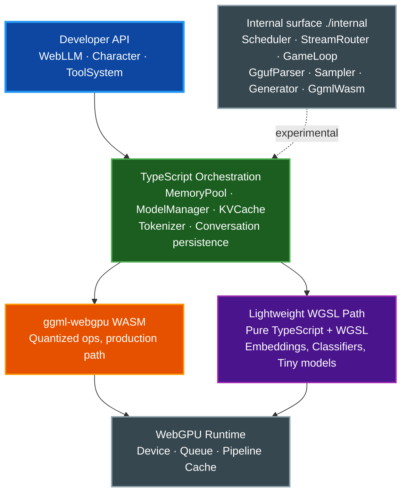
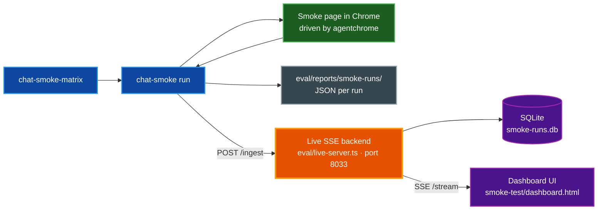

# @paulrobello/webllm

[](LICENSE)

High-performance LLM inference in the browser via WebGPU, backed by llama.cpp's
`ggml-webgpu` backend. Supports hierarchical multi-model scheduling with
frame-budget-aware execution for interactive applications.

## Table of Contents

- [Features](#features)
- [Prerequisites](#prerequisites)
- [Installation](#installation)
- [Quick Start](#quick-start)
- [Architecture](#architecture)
- [API Overview](#api-overview)
- [Embeddings](#embeddings)
- [Conversation persistence](#conversation-persistence)
- [Development](#development)
- [Evaluation & Live Dashboard](#evaluation--live-dashboard)
- [Releasing](#releasing)
- [License](#license)

## Features

- **GGUF model parsing** — read quantized GGUF binary format directly in the browser
- **Multi-architecture inference** — Llama, Qwen, Mistral, Phi-3, Gemma 2 / Gemma 4, BERT-family encoders, and the Qwen3-Embedding causal-embedder over a patched `ggml-webgpu` WASM backend
- **Memory budget enforcement** — `MemoryPool` tracks model-weight allocations against a configurable budget so `ModelManager.canLoad` reflects real VRAM headroom (post the 8B-ceiling / 16 GB-floor doctrine)
- **Character system** — personas with system prompts, streaming chat, and tool / function calling
- **Lightweight WGSL path** — pure TypeScript + WGSL shaders for sub-50M parameter models (no WASM)
- **Three-tier embeddings** — `engine.embed()` dispatches across dedicated encoders, causal-embedders, and chat-model tap-point embedding (bucket D) gated per-model by `embeddingCapable: true`
- **Tokenization** — SentencePiece (SPM) and Byte Pair Encoding (BPE) tokenizers
- **Worker mode** — off-main-thread WebGPU + WASM via a typed RPC layer with an error codec that reconstructs the typed error hierarchy across `postMessage`
- **Conversation persistence** — export/import primitives over a `WLKV` wire format (`schemaVersion` tracked as a compatibility surface) plus an optional `IndexedDBConversationStore`
- **Evaluation harness** — micro-benchmarks, offline task evaluation, browser-driven chat regression with profile-based sweeps, and a live SSE + SQLite dashboard for side-by-side comparison of multiple runs

## Prerequisites

**Consumers** (apps that depend on `@paulrobello/webllm`):

- A **WebGPU-capable browser**. The library is developed and regression-tested
  against **Chrome**; the WASM backend assumes JSPI support and a 128 MiB
  `maxStorageBufferBindingSize` per binding (Chrome-shaped constraints
  documented in `CLAUDE.md`). Other WebGPU-shaped browsers are not tested.

**Contributors** (working on this repo):

- **Bun** — tooling, tests, and the eval harnesses (see `package.json` for
  the pinned version).
- **Chrome with WebGPU** — for the browser regression workflow (any GPU-path
  change is gated by a manual smoke run, not the Bun suite).
- **Emscripten SDK + a local patched `llama.cpp`** at `~/Repos/llama.cpp/`
  on branch `webllm-browser-patches` — **only** for `make wasm-build`. Most
  contributions do not need these; see
  [`docs/LLAMA_CPP_PATCHES.md`](docs/LLAMA_CPP_PATCHES.md) when they do.

See [`CONTRIBUTING.md`](CONTRIBUTING.md) for the full contributor setup.

## Installation

```bash
bun add @paulrobello/webllm
```

## Quick Start

The library ships a WebAssembly module (`webllm-wasm.js` + `webllm-wasm.wasm`,
plus a `webllm-wasm-mem64.*` variant for models > 3.5 GiB) that must be served
from your application alongside the JS bundle. The engine acquires its own
WebGPU device internally via `navigator.gpu.requestAdapter()` — you do not
pass a `device` into the config. `loadModelFromBuffer` picks the right WASM
variant based on the model file size; pass an explicit `wasmUrl` to override.

```typescript
import { WebLLM } from "@paulrobello/webllm";

// 1. Fetch the GGUF model into memory.
const buffer = await fetch("/models/llama-3.2-3b-q4_k_m.gguf")
  .then((r) => r.arrayBuffer());

// 2. Load the model. The factory constructs the engine, acquires a WebGPU
//    device, parses the GGUF, instantiates the WASM backend, uploads
//    weights to the GPU, and returns an engine bound to the model.
//    `memoryBudget` is optional and defaults to 8 GiB; set it lower to
//    cap how much VRAM the MemoryPool will let loaded models consume.
const { engine, handle } = await WebLLM.loadModelFromBuffer(
  buffer,
  "shopkeeper",
  {
    memoryBudget: 8 * 1024 * 1024 * 1024, // optional; defaults to 8 GiB
    cacheDir: "indexeddb://webllm-cache",
  },
);

// 3a. Streaming chat completion (OpenAI-style messages):
for await (const chunk of engine.chatCompletion(handle.id, [
  { role: "system", content: "You are a friendly shopkeeper." },
  { role: "user", content: "What do you sell?" },
], { maxTokens: 256, temperature: 0.7 })) {
  if (chunk.text) process.stdout.write(chunk.text);
  if (chunk.done) console.log("\nstats:", chunk.stats);
}

// 3b. …or build a Character with a persistent system prompt and tools:
const npc = engine.createCharacter({
  modelId: handle.id,
  systemPrompt: "You are a friendly shopkeeper in a fantasy village.",
  temperature: 0.7,
  maxTokens: 256,
  tools: [{
    name: "check_inventory",
    description: "Check if an item is in stock",
    parameters: {
      item: { type: "string", required: true, description: "The item to check" },
    },
    handler: async (args) => db.query(args.item as string),
  }],
});

for await (const token of npc.chat("What do you sell?")) {
  dialogueBox.addText(token);
}

await engine.removeCharacter(npc.id);
await engine.shutdown();
```

> **Heads-up.** The `loadModelFromBuffer` factory creates the engine for you.
> If you need to wire several models against a shared engine instance, build
> additional models with the same pattern and reuse the returned `engine`
> reference, or pre-build the inference pipeline by hand and call
> `engine.adoptPreloadedModel(name, pipeline)` instead. For a worker-mode
> setup, call `WebLLM.init({ worker: true })` and use the returned proxy.

## Architecture

The TypeScript orchestration layer sits on top of two interchangeable
inference backends: a WASM-compiled `ggml-webgpu` core for quantized
production models, and a pure-WGSL path for tiny models that bypasses WASM
entirely. Both backends share the same tokenization, sampling, and
streaming infrastructure. The `MemoryPool` tracks model-weight allocations
against `WebLLMConfig.memoryBudget` (optional, defaults to 8 GiB) so that
`ModelManager.canLoad` reflects real VRAM headroom — sizing follows the
project's 16 GB-floor / 8B-ceiling doctrine (see `CLAUDE.md`).



> **Note:** `Scheduler`, `StreamRouter`, `GameLoop`, and the core
> `PipelineCache` are experimental orchestration modules that live under the
> unstable `./internal` subpath (see
> [`docs/RELEASING.md`](docs/RELEASING.md#publishing-surface)); they are not
> part of the semver-stable consumer API and are not wired into the live
> inference path the way `MemoryPool` and `ModelManager` are.

## API Overview

The public root barrel (`src/index.ts`) is the semver-stable consumer
surface. Unstable internals live under the `./internal` subpath with no
semver guarantees; persistence helpers live under `./persistence`.

| API | Description |
|-----|-------------|
| `WebLLM` | Main engine — `init`, model loading, chat completion, conversation + character management, embeddings |
| `Character` | Chat persona with system prompt, tools, and streaming output |
| `CharacterManager` | Lifecycle management for character instances |
| `ToolSystem` | Function / tool calling with XML and JSON pattern parsing |
| `Tokenizer`, `StreamingDecoder` | SPM and BPE tokenization with encode / decode |
| `KVCache` | Per-model KV cache bookkeeping (real KV state lives WASM-side) |
| `ModelLoader` | Model loading with hyperparameter and tokenizer extraction |
| `MemoryPool` | Tracks weight allocations against `WebLLMConfig.memoryBudget`; feeds `ModelManager.canLoad` |
| `ModelManager` | Multi-model lifecycle and memory coordination |
| `EncoderInference`, `CausalLMEmbedder` | Encoder and causal-embedder inference engines (tiers 1 and 2 of `engine.embed()`) |
| `runTask`, `runTasks`, `score`, `EngineDeadError` | Evaluation runner + scorer primitives (library-reusable) |
| `registerCustomScorer`, `getCustomScorer`, `hasCustomScorer`, `listCustomScorer` | Custom-scorer registry for eval tasks |
| `collectBrowserSystemProfile`, `computeSystemId` | Browser system-profile fingerprinting for eval |
| `MISTRAL_DEFAULTS`, `PHI3_DEFAULTS`, `QWEN_THINKING_DEFAULTS`, `QWEN_NON_THINKING_DEFAULTS` | Sampling profiles for chat-template families |
| `WebLLMError` and the typed error hierarchy (`ModelNotFoundError`, `IncompatibleConversationError`, `CorruptBlobError`, `PersistenceQuotaError`, …) | Typed errors thrown across the consumer surface |

Persistence surface (imported from `@paulrobello/webllm/persistence`):
`IndexedDBConversationStore`, plus `WebLLM.prototype.exportConversation`
and `WebLLM.prototype.importConversation` for apps that need OPFS,
server-side sync, or encrypted-at-rest via their own `Uint8Array` store
against the same `WLKV` wire format.

Internals (imported from `@paulrobello/webllm/internal` — no semver
guarantees, used by the smoke harness and power users): `ModelInference`,
`GgmlWasm`, `GgufParser`, `InferenceSession`, `Sampler`, `Generator`,
`LightweightModel`, `Scheduler`, `StreamRouter`, `GameLoop`,
`PipelineCache`, `detectChatTemplate`, `encodeChatPrompt`.

## Embeddings

`engine.embed(modelId, text)` returns an L2-normalized `Float32Array` for use
in semantic search, clustering, or RAG pipelines. The method dispatches across
three tiers in priority order:

| Tier | Model type | Example | Quality |
|------|-----------|---------|---------|
| 1 — Encoder | Bidirectional BERT/RoBERTa | `bge-large-en-v1.5` | Highest (purpose-built) |
| 2 — Causal-embedder | Causal-LM fine-tuned for retrieval | `qwen3-embedding-0.6b-hyb` | High (MTEB-competitive) |
| 3 — Chat-model (bucket D) | Chat model with `embeddingCapable: true` | `qwen3-8b-iq3m` | Good (5-15% MTEB delta vs tier 2) |

**Which tier should I use?**

- **General-purpose retrieval** — use a dedicated encoder (tier 1) or
  causal-embedder (tier 2). They are purpose-trained for semantic similarity
  and deliver the best MTEB scores.
- **In-domain agent retrieval with a single loaded model** — bucket D (tier 3)
  lets the chat model already in memory serve embedding queries without loading
  a second model. The 5-15% MTEB delta is acceptable for most agent dialogue
  and episodic memory use cases; the VRAM savings are significant on the
  16 GB floor.
- **Uncertainty** — benchmark both on your workload. The dispatch is
  transparent: load only the models you need and the right tier is used
  automatically.

**Registering a bucket D model** — set `embeddingCapable: true` in the model's
registration entry in `eval/models.ts`. Only models that have passed the parity
gate (≥ 0.90 cosine similarity against a dedicated embedder on the canonical
benchmark suite) are eligible. See
`eval/reports/bucket-d-parity-2026-04-29/SUMMARY.md` for the current list.

## Conversation persistence

Conversations and their KV state evaporate on page reload. Apps that
want to preserve conversation state across reloads use the
`exportConversation` / `importConversation` engine primitives plus the
optional `IndexedDBConversationStore` helper.

```ts
import { WebLLM } from "@paulrobello/webllm";
import { IndexedDBConversationStore } from "@paulrobello/webllm/persistence";

const webllm = await WebLLM.init({ memoryBudget: 8 * 1024 ** 3, worker: true });
const { handle: model } = await webllm.loadModelFromUrl(url, "qwen3-8b");
const store = new IndexedDBConversationStore("my-app-conversations");

let conv;
const blob = await store.get("user-42-session");
try {
  conv = blob
    ? await webllm.importConversation(model.id, blob)
    : await webllm.createConversation(model.id);
} catch (e) {
  // IncompatibleConversationError or CorruptBlobError → discard, restart
  await store.delete("user-42-session");
  conv = await webllm.createConversation(model.id);
}

// Per turn, after chatCompletion settles:
const fresh = await webllm.exportConversation(conv);
await store.put("user-42-session", fresh);
```

Apps that need OPFS, server-side sync, or encrypted-at-rest implement
their own store against the same `Uint8Array` contract — the engine
primitives don't depend on any specific storage backend.

The wire format is `magic[4] + uint32 LE headerLen + JSON header + raw kvBytes`
with magic bytes `WLKV`. The header carries an integer `schemaVersion`,
a `ModelFingerprint` (architecture, vocab, layer/head shape, RoPE base,
quantization, tokenizer hash), the conversation options, the token-ID
prefix, the KV byte size, and a save timestamp. `importConversation`
refuses any blob whose fingerprint doesn't match the loaded model and
throws `IncompatibleConversationError` (with a `reason` distinguishing
schema/fingerprint/tokenizer mismatch). Corrupt bytes throw
`CorruptBlobError`. Quota errors from the IndexedDB helper surface as
`PersistenceQuotaError`. See
[`docs/superpowers/specs/2026-05-03-prefix-cache-persistence-design.md`](docs/superpowers/specs/2026-05-03-prefix-cache-persistence-design.md)
for the full taxonomy and worker-mode marshaling details.

## Development

The Makefile is the single source of truth for tooling. `make help` lists
every target with descriptions.

```bash
make install          # Install dependencies (bun install)
make checkall         # fmt + lint + typecheck + test — the ship gate
make test             # Run the Bun test suite
make build            # Bundle src/ into dist/
make wasm-build       # Rebuild the ggml-webgpu WASM (requires emsdk)
```

A single test: `bun test tests/<file>.test.ts` or
`bun test -t "<pattern>"`.

### Browser smoke test

```bash
make smoke-serve      # Build + serve smoke-test/ on http://localhost:8031
make smoke-open       # Open the smoke-test page in the default browser
```

The smoke-test page accepts URL overrides for `thinking`, `ctx`, `max`,
`temp`, `topK`, `topP`, `rep`, `seed`, `prompt`, and `profile` — see
`smoke-test/real-model-page.js` for the full parser.

### Chat page

`smoke-test/chat.html` provides a focused multi-turn chat surface
against the registered chat-model fleet, with live context / TTFT /
decode metrics, a settings panel, and single-slot persistence across
reloads. Run `make chat-run` to build, serve, and open the page in
your default browser; or `make smoke-serve` and navigate manually to
`http://localhost:8031/chat.html`. See [`docs/CHAT_PAGE.md`](docs/CHAT_PAGE.md)
for the manual smoke checklist.

### Benchmarks

```bash
make bench-perf                       # Mitata micro-benchmarks (no browser)
make bench-inference                  # End-to-end Chrome inference perf
make bench-chat-smoke-matrix          # Default browser-driven chat matrix
make bench-chat-smoke-matrix-full     # Full matrix incl. Qwen3 thinking-on
make bench-browser-eval PROFILE=<p>   # Real-browser accuracy eval for one profile (needs dashboard)
make bench-full                       # Speed + accuracy across the full profile set (needs dashboard)
```

Browser-driven targets automatically restart a fresh smoke-test server each
run. See [`docs/BENCHMARKS.md`](docs/BENCHMARKS.md) for methodology and
metric definitions, and [`docs/reference/environment.md`](docs/reference/environment.md)
for every `WEBLLM_*` environment variable and Makefile override the
harnesses consume (`WEBLLM_LIVE_BENCH_URL`, `WEBLLM_BENCH_EVAL_TEMPERATURE`,
`WEBLLM_STALL_TIMEOUT_MS`, `PERF_MODEL`, etc.).

## Evaluation & Live Dashboard

The repo ships a Bun-backed SSE dashboard at
[`smoke-test/dashboard.html`](smoke-test/dashboard.html) for comparing runs
across models, profiles, and sampling parameters in real time.

```bash
make dashboard-serve   # SSE backend on http://localhost:8033, SQLite-persisted
```

Point browser benches at the dashboard with `WEBLLM_LIVE_BENCH_URL`:

```bash
WEBLLM_LIVE_BENCH_URL=http://localhost:8033 \
  bun run eval/chat-smoke-matrix.ts --profiles llama-vs-qwen
```

Each run also writes a JSON record to `eval/reports/smoke-runs/` as a
durable archive independent of the dashboard's SQLite store.



Profiles (`eval/smoke-profiles.ts`) pin `{ model, thinking, temperature,
topK, topP, repetitionPenalty, seed, contextLength, maxTokens, prompt }`
for reproducible comparison. Profile sets like `llama-vs-qwen`,
`temperature-sweep`, and `thinking-modes` group related profiles for
one-command sweeps.

## Releasing

Releases go through CI/CD only — never run `npm publish` locally. The flow
is: bump `version` in `package.json` → move `CHANGELOG.md` entries from
`[Unreleased]` into a new version section → tag `v<semver>` → push the tag
so CI publishes. Conversation-persistence `schemaVersion` bumps are
breaking changes for saved blobs and must be recorded in `CHANGELOG.md`.
See [`docs/RELEASING.md`](docs/RELEASING.md) for the full flow,
publishing-surface rules, and the tracked compatibility surfaces.

## Related Documentation

- [`CHANGELOG.md`](CHANGELOG.md) — versioned change history
- [`CONTRIBUTING.md`](CONTRIBUTING.md) — setup, ship gate, browser workflow, commit conventions
- [`docs/MODEL_SUPPORT.md`](docs/MODEL_SUPPORT.md) — supported models, quants, architectures, and embeddings
- [`docs/BENCHMARKS.md`](docs/BENCHMARKS.md) — benchmark methodology and metrics
- [`docs/LLAMA_CPP_PATCHES.md`](docs/LLAMA_CPP_PATCHES.md) — local patch inventory and rebase procedure
- [`docs/reference/environment.md`](docs/reference/environment.md) — benchmark and harness environment variables
- [`docs/RELEASING.md`](docs/RELEASING.md) — release flow, publishing surface, compatibility surfaces
- [`docs/DOCUMENTATION_STYLE_GUIDE.md`](docs/DOCUMENTATION_STYLE_GUIDE.md) — documentation conventions
- [`CLAUDE.md`](CLAUDE.md) — repo guidance for Claude Code sessions

## License

MIT — see [`LICENSE`](LICENSE).
