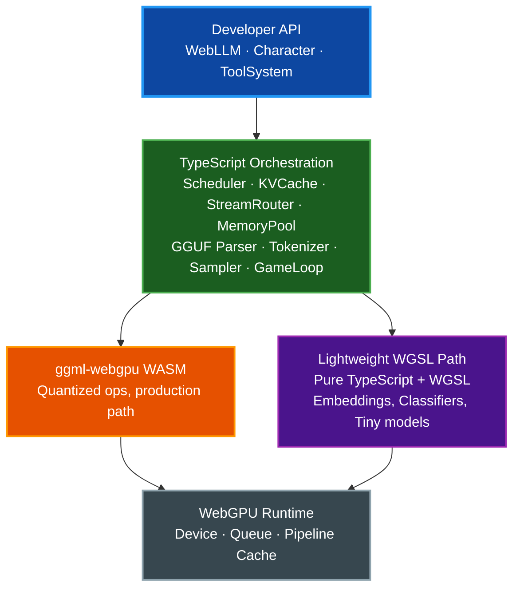
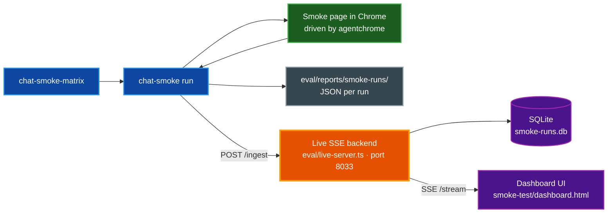

# @paulrobello/webllm

[](LICENSE)

High-performance LLM inference in the browser via WebGPU, backed by llama.cpp's
`ggml-webgpu` backend. Supports hierarchical multi-model scheduling with
frame-budget-aware execution for interactive applications.

## Table of Contents

- [Features](#features)
- [Installation](#installation)
- [Quick Start](#quick-start)
- [Architecture](#architecture)
- [API Overview](#api-overview)
- [Development](#development)
- [Evaluation & Live Dashboard](#evaluation--live-dashboard)
- [License](#license)

## Features

- **GGUF model parsing** — read quantized GGUF binary format directly in the browser
- **Multi-model scheduling** — priority-based cooperative scheduler with configurable frame budgets
- **KV cache management** — paged KV cache with multi-sequence sharing and cross-session prompt caching
- **Character system** — personas with system prompts, streaming chat, and tool / function calling
- **Lightweight WGSL path** — pure TypeScript + WGSL shaders for sub-50M parameter models (no WASM)
- **Memory management** — GPU buffer pool with pressure detection and priority-based eviction
- **Game loop integration** — `requestAnimationFrame`-aware scheduling for real-time applications
- **Tokenization** — SentencePiece (SPM) and Byte Pair Encoding (BPE) tokenizers
- **Evaluation harness** — micro-benchmarks, offline task evaluation, browser-driven chat regression with profile-based sweeps, and a live SSE + SQLite dashboard for side-by-side comparison of multiple runs

## Installation

```bash
bun add @paulrobello/webllm
```

## Quick Start

```typescript
import { WebLLM } from "@paulrobello/webllm";

const adapter = await navigator.gpu.requestAdapter();
const device = await adapter.requestDevice();

const engine = await WebLLM.init({
  device,
  cacheDir: "indexeddb://webllm-cache",
  memoryBudget: 2048 * 1024 * 1024, // 2 GB VRAM
  frameBudgetMs: 8,
});

const model = await engine.loadModel("llama-3.2-3b-q4_k_m.gguf", {
  priority: 0,
  contextLength: 4096,
});

const npc = engine.createCharacter({
  modelId: model.id,
  systemPrompt: "You are a friendly shopkeeper in a fantasy village.",
  temperature: 0.7,
  maxTokens: 256,
  tools: [{
    name: "check_inventory",
    description: "Check if an item is in stock",
    parameters: {
      item: { type: "string", required: true, description: "The item to check" },
    },
    handler: async (args) => db.query(args.item),
  }],
});

for await (const token of npc.chat("What do you sell?")) {
  dialogueBox.addText(token);
}

await engine.removeCharacter(npc.id);
await engine.shutdown();
```

## Architecture

The TypeScript orchestration layer sits on top of two interchangeable
inference backends: a WASM-compiled `ggml-webgpu` core for quantized
production models, and a pure-WGSL path for tiny models that bypasses WASM
entirely. Both backends share the same tokenization, sampling, streaming,
and scheduling infrastructure.



## API Overview

| Class | Description |
|-------|-------------|
| `WebLLM` | Main engine — initialization, model loading, character management |
| `Character` | Chat persona with system prompt, tools, and streaming output |
| `CharacterManager` | Lifecycle management for character instances |
| `ToolSystem` | Function / tool calling with XML and JSON pattern parsing |
| `Tokenizer` | SPM and BPE tokenization with encode / decode |
| `Sampler` | Token sampling with temperature, top-k, top-p, repetition penalty |
| `Generator` | Autoregressive generation loop with async generators |
| `StreamRouter` | Fan-out token streaming to multiple consumers with backpressure |
| `GgufParser` | GGUF binary format parser for model files |
| `ModelLoader` | Model loading with hyperparameter and tokenizer extraction |
| `KVCache` | Paged KV cache with multi-sequence sharing |
| `InferenceSession` | Per-session inference state tracking |
| `Scheduler` | Priority-based cooperative task scheduler |
| `MemoryPool` | GPU buffer allocation with pressure-based eviction |
| `ModelManager` | Multi-model lifecycle and memory coordination |
| `PipelineCache` | IndexedDB-backed WebGPU pipeline cache |
| `GameLoop` | Frame-budget-aware game loop for inference ticks |
| `GgmlWasm` | WebAssembly bridge for ggml-webgpu tensor operations |
| `LightweightModel` | Pure WGSL inference for small models |

## Development

The Makefile is the single source of truth for tooling. `make help` lists
every target with descriptions.

```bash
make install          # Install dependencies (bun install)
make checkall         # fmt + lint + typecheck + test — the ship gate
make test             # Run the Bun test suite
make build            # Bundle src/ into dist/
make wasm-build       # Rebuild the ggml-webgpu WASM (requires emsdk)
```

A single test: `bun test tests/<file>.test.ts` or
`bun test -t "<pattern>"`.

### Browser smoke test

```bash
make smoke-serve      # Build + serve smoke-test/ on http://localhost:8031
make smoke-open       # Open the smoke-test page in the default browser
```

The smoke-test page accepts URL overrides for `thinking`, `ctx`, `max`,
`temp`, `topK`, `topP`, `rep`, `seed`, `prompt`, and `profile` — see
`smoke-test/real-model-page.js` for the full parser.

### Benchmarks

```bash
make bench-perf                    # Mitata micro-benchmarks (no browser)
make bench-eval                    # Offline task eval (HTML report)
make bench-inference               # End-to-end Chrome inference perf
make bench-chat-smoke-matrix       # Default browser-driven chat matrix
make bench-chat-smoke-matrix-full  # Full matrix incl. Qwen3 thinking-on
make bench-all                     # Offline subset (bench-perf + bench-eval)
```

Browser-driven targets automatically restart a fresh smoke-test server each
run. See [`docs/BENCHMARKS.md`](docs/BENCHMARKS.md) for methodology and
metric definitions.

## Evaluation & Live Dashboard

The repo ships a Bun-backed SSE dashboard at
[`smoke-test/dashboard.html`](smoke-test/dashboard.html) for comparing runs
across models, profiles, and sampling parameters in real time.

```bash
make dashboard-serve   # SSE backend on http://localhost:8033, SQLite-persisted
```

Point browser benches at the dashboard with `WEBLLM_LIVE_BENCH_URL`:

```bash
WEBLLM_LIVE_BENCH_URL=http://localhost:8033 \
  bun run eval/chat-smoke-matrix.ts --profiles llama-vs-qwen
```

Each run also writes a JSON record to `eval/reports/smoke-runs/` as a
durable archive independent of the dashboard's SQLite store.



Profiles (`eval/smoke-profiles.ts`) pin `{ model, thinking, temperature,
topK, topP, repetitionPenalty, seed, contextLength, maxTokens, prompt }`
for reproducible comparison. Profile sets like `llama-vs-qwen`,
`temperature-sweep`, and `thinking-modes` group related profiles for
one-command sweeps.

## Related Documentation

- [`docs/BENCHMARKS.md`](docs/BENCHMARKS.md) — benchmark methodology and metrics
- [`docs/DOCUMENTATION_STYLE_GUIDE.md`](docs/DOCUMENTATION_STYLE_GUIDE.md) — documentation conventions
- [`CLAUDE.md`](CLAUDE.md) — repo guidance for Claude Code sessions

## License

MIT
