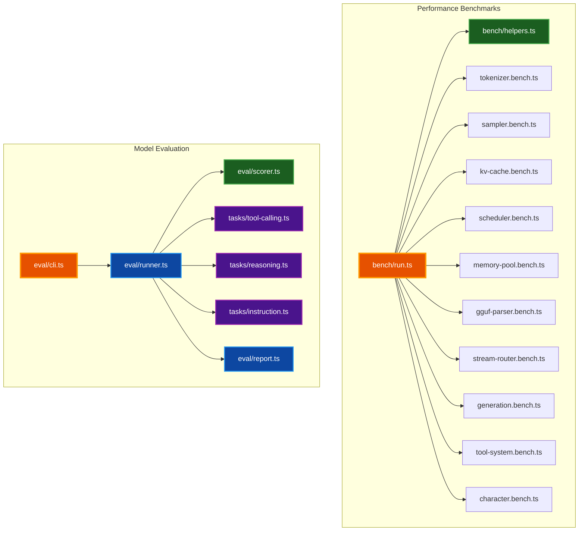

# Benchmarks & Evaluation

Comprehensive guide to WebLLM's performance microbenchmarks and model quality evaluation framework. Use these tools to measure component throughput, track regressions, and assess model capability across tool calling, reasoning, instruction following, semantic reasoning, and embeddings.

## Table of Contents

- [Overview](#overview)
- [Architecture](#architecture)
- [Performance Microbenchmarks](#performance-microbenchmarks)
- [Model Quality Evaluation](#model-quality-evaluation)
- [Running Benchmarks](#running-benchmarks)
- [Interpreting Results](#interpreting-results)
- [Adding New Benchmarks](#adding-new-benchmarks)
- [Related Documentation](#related-documentation)

## Overview

WebLLM provides two complementary benchmarking systems:

- **Performance Microbenchmarks** — Measure throughput and latency of individual TypeScript components using mitata
- **Model Quality Evaluation** — Assess model behavior across five dimensions: tool calling, reasoning, instruction following, semantic reasoning, and embedding-vector cosine similarity

Both systems run locally via Bun with no external dependencies beyond `mitata` for microbenchmarking.

## Architecture



## Performance Microbenchmarks

### What Gets Benchmarked

The microbenchmark suite measures pure TypeScript component performance. These do not require GPU/WASM — they test the orchestration layer that wraps the inference engine.

| File | Component | What It Measures |
|------|-----------|-----------------|
| `tokenizer.bench.ts` | `Tokenizer` | BPE/SPM encode at short/medium/long text, token decode |
| `sampler.bench.ts` | `Sampler` | `sample()` at 1K/32K/128K vocab, individual transforms |
| `kv-cache.bench.ts` | `KVCache` | `findSlots` for 1/128 slots, `updateSlots`, `evictSequence`, `sharePromptCells` |
| `scheduler.bench.ts` | `Scheduler` | Enqueue 10/100 tasks, dequeue, `runFrame`, `preemptModel` |
| `memory-pool.bench.ts` | `MemoryPool` | Allocate/free 1000 buffers, `evictForAllocation`, `evictModel`, `getModelUsage` |
| `gguf-parser.bench.ts` | `GgufParser` | Parse minimal/small/medium/large GGUF buffers |
| `stream-router.bench.ts` | `StreamRouter` | Emit to 1/5 consumers, full round-trip |
| `generation.bench.ts` | `Generator` | Generate 50/200 tokens with mock forward pass |
| `tool-system.bench.ts` | `ToolSystem` | `parseToolCall` XML/JSON/negative, `execute`, `formatForPrompt` |
| `character.bench.ts` | `Character` | Construction, chat stub, `getHistory`, `clearHistory` |

### Shared Helpers

`bench/helpers.ts` provides synthetic data generators used across all benchmark files:

- `makeRandomLogits(vocabSize)` — Random `Float32Array` for sampler benchmarks
- `makeBpeTokenData()` — BPE token/merge/vocab maps for tokenizer benchmarks
- `makeSpmTokenData()` — SPM token/score/vocab maps for tokenizer benchmarks
- `makeKVCacheConfig(nLayers, nCells)` — KVCache configuration
- `makePopulatedKVCache(nCells, nSequences)` — Pre-populated KVCache
- `makeMinimalGgufBuffer(metadataCount, tensorCount)` — Synthetic GGUF binary data

### Example Output

```text
benchmark                               avg (min … max)       p75 / p99
------------------------------------------------------- -------------------------------
• BPE encode
short text                              259.15 ns/iter        245.97 ns
medium text                               3.63 µs/iter          3.66 µs
long text                                23.49 µs/iter         22.22 µs

• Sampler (32K vocab)
sample (full pipeline, greedy)          142.31 µs/iter       145.80 µs
applyTemperature                         28.44 µs/iter        29.10 µs
applyTopK (k=40)                         45.67 µs/iter        47.20 µs
```

## Model Quality Evaluation

### Evaluation Dimensions

The evaluation framework tests model quality across five dimensions. The
three chat-quality dimensions (tool calling, reasoning, instruction
following) and semantic reasoning each carry 12 tasks at three difficulty
levels; the embedding dimension carries 8 tasks. That is 56 tasks total.

```mermaid
graph TD
    Eval[Model Evaluation] --> TC[Tool Calling]
    Eval --> RS[Reasoning]
    Eval --> IN[Instruction Following]
    Eval --> SR[Semantic Reasoning]
    Eval --> EMB[Embedding]

    TC --> TCE[Easy — 4 tasks]
    TC --> TCM[Medium — 4 tasks]
    TC --> TCH[Hard — 4 tasks]

    RS --> RSE[Easy — 4 tasks]
    RS --> RSM[Medium — 4 tasks]
    RS --> RSH[Hard — 4 tasks]

    IN --> INE[Easy — 4 tasks]
    IN --> INM[Medium — 4 tasks]
    IN --> INH[Hard — 4 tasks]

    SR --> SRE[Easy — 4 tasks]
    SR --> SRM[Medium — 4 tasks]
    SR --> SRH[Hard — 4 tasks]

    EMB --> EMBT[8 cosine-similarity tasks]

    style Eval fill:#e65100,stroke:#ff9800,stroke-width:3px,color:#ffffff
    style TC fill:#0d47a1,stroke:#2196f3,stroke-width:2px,color:#ffffff
    style RS fill:#1b5e20,stroke:#4caf50,stroke-width:2px,color:#ffffff
    style IN fill:#4a148c,stroke:#9c27b0,stroke-width:2px,color:#ffffff
    style SR fill:#1a237e,stroke:#3f51b5,stroke-width:2px,color:#ffffff
    style EMB fill:#880e4f,stroke:#c2185b,stroke-width:2px,color:#ffffff
    style TCE fill:#37474f,stroke:#78909c,stroke-width:1px,color:#ffffff
    style TCM fill:#37474f,stroke:#78909c,stroke-width:1px,color:#ffffff
    style TCH fill:#37474f,stroke:#78909c,stroke-width:1px,color:#ffffff
    style RSE fill:#37474f,stroke:#78909c,stroke-width:1px,color:#ffffff
    style RSM fill:#37474f,stroke:#78909c,stroke-width:1px,color:#ffffff
    style RSH fill:#37474f,stroke:#78909c,stroke-width:1px,color:#ffffff
    style INE fill:#37474f,stroke:#78909c,stroke-width:1px,color:#ffffff
    style INM fill:#37474f,stroke:#78909c,stroke-width:1px,color:#ffffff
    style INH fill:#37474f,stroke:#78909c,stroke-width:1px,color:#ffffff
    style SRE fill:#37474f,stroke:#78909c,stroke-width:1px,color:#ffffff
    style SRM fill:#37474f,stroke:#78909c,stroke-width:1px,color:#ffffff
    style SRH fill:#37474f,stroke:#78909c,stroke-width:1px,color:#ffffff
    style EMBT fill:#37474f,stroke:#78909c,stroke-width:1px,color:#ffffff
```



#### Tool Calling (`tc-001` through `tc-012`)

Measures the model's ability to produce valid tool calls with correct function names and arguments.

| Difficulty | Tasks | Skills Tested |
|-----------|-------|---------------|
| **Easy** | `tc-001` to `tc-004` | Single tool call, one/multiple params, recognizing when no tool is needed, enum params |
| **Medium** | `tc-005` to `tc-008` | Selecting correct tool from multiple options, optional params, ambiguous input routing, numeric args |
| **Hard** | `tc-009` to `tc-012` | Sequential tool chains, error recovery, product-price chains, rejecting harmful requests |

#### Reasoning (`rs-001` through `rs-012`)

Measures factual knowledge, logical deduction, and mathematical reasoning.

| Difficulty | Tasks | Skills Tested |
|-----------|-------|---------------|
| **Easy** | `rs-001` to `rs-004` | Basic arithmetic, geography, counting, common knowledge |
| **Medium** | `rs-005` to `rs-008` | Syllogistic logic, percentage calculations, decimal comparison, cause-and-effect |
| **Hard** | `rs-009` to `rs-012` | Rate-distance problems, temporal reasoning, trick questions, water jug puzzle |

#### Instruction Following (`in-001` through `in-012`)

Measures format compliance, constraint adherence, and multi-step instruction execution.

| Difficulty | Tasks | Skills Tested |
|-----------|-------|---------------|
| **Easy** | `in-001` to `in-004` | Bullet points, sentence count, prefix constraint, number-only response |
| **Medium** | `in-005` to `in-008` | JSON schema output, numbered lists, required words, forbidden words |
| **Hard** | `in-009` to `in-012` | Multi-constraint formatting, conditional responses, typed JSON, ordered answers |

#### Semantic Reasoning (`sr-001` through `sr-012`)

Measures chat-style semantic understanding — paraphrase, synonym,
near-equivalence, and lightweight entailment — using cosine similarity
against a reference answer rather than exact-match scoring. This dimension
is distinct from the `embedding` dimension: semantic-reasoning tasks drive
the model through `engine.chatCompletion` and score the *generated* answer's
embedding against a reference, while embedding-dimension tasks score the
embed of a raw input string.

| Difficulty | Tasks | Skills Tested |
|-----------|-------|---------------|
| **Easy** | `sr-001` to `sr-004` | Direct synonym / paraphrase recognition |
| **Medium** | `sr-005` to `sr-008` | Paraphrase under constraint, antonym distinction |
| **Hard** | `sr-009` to `sr-012` | Multi-sentence entailment, nuanced semantic equivalence |

#### Embedding (`emb-001` through `emb-008`)

Measures embedding-vector quality via cosine similarity. The runner calls
`engine.embed(modelId, text)` for both the input and the expected text,
maps cosine ∈ [-1, 1] to a score ∈ [0, 1] via `(cos + 1) / 2`, and compares
against a per-task `threshold`. This dimension only runs against models
that dispatch through one of the three `engine.embed()` tiers (encoder,
causal-embedder, or chat-model tap with `embeddingCapable: true`); see
[`docs/MODEL_SUPPORT.md`](MODEL_SUPPORT.md#embeddings).

| Tasks | Scoring | Notes |
|-------|---------|-------|
| 8 (no difficulty split) | `cosine_similarity` vs reference, threshold pass/fail | Requires an embedding-capable registered model |

### Scoring Methods

Each task uses one of nine scoring methods defined by the `ScoringMethod`
union in `src/evaluation/types.ts` (`eval/types.ts` is a thin re-export
shim that re-exports the library types into the eval harness namespace):

| Method | How It Scores | Used For |
|--------|---------------|----------|
| `exact` | Case-insensitive exact match: 1.0 or 0.0 | Precise factual answers |
| `contains` | Substring presence: 1.0 or 0.0 | Checking for specific values in output |
| `regex` | Regex pattern match: 1.0 or 0.0 | Format validation |
| `json_schema` | Field type matching: ratio of correct fields | JSON output validation |
| `tool_call` | Name match (0.5) + arg matching (0.5 × ratio) | Single tool call accuracy |
| `tool_call_chain` | Sequential step matching: ratio of correct steps | Multi-step tool usage |
| `no_tool_call` | Absence of tool call: 1.0 or 0.0 | Recognizing non-tool inputs |
| `custom` | Arbitrary scoring function: 0.0 to 1.0 | Complex multi-constraint checks |
| `cosine_similarity` | Embedding cosine vs reference, mapped to [0,1]; threshold pass/fail | Embedding-dimension tasks (`emb-*`) and semantic-reasoning (`sr-*`) |

### Report Format

Reports include per-dimension aggregates and individual task results:

```text
Model Evaluation Report
Model: llama-3.2-3b-q4_k_m | 2026-04-20T12:00:00Z

DIMENSION              SCORE    PASSED   AVG LATENCY
tool-calling           0.75     9/12     142ms
reasoning              0.83     10/12    98ms
instruction-following  0.67     8/12     115ms

Overall: 0.75 (27/36 tasks)

FAILURES:
  tc-009  score: 0.00  "Expected tool_call_chain, got single call"
  rs-012  score: 0.50  "Partial: described steps but wrong order"
  in-009  score: 0.33  "1 of 3 constraints met"
```

JSON reports are saved to `eval/reports/<timestamp>-<modelId>.json`.

## Running Benchmarks

### Performance Microbenchmarks

```bash
# Run all performance benchmarks
make bench

# Or via bun directly
bun run bench
```

### Model Quality Evaluation

Accuracy evaluation requires real WebGPU inference; there is no offline-only
path. Use `bench-browser-eval` (per profile) or `bench-full` (full sweep) —
both drive the smoke page in Chrome and stream results to the live dashboard.

```bash
# List the 44 evaluation tasks wired into eval/cli.ts (offline; no engine needed)
make bench-eval-list

# Single profile — needs `make dashboard-serve` running on $(DASHBOARD_PORT)
make bench-browser-eval PROFILE=qwen3-0.6b-off-warm \
    WEBLLM_LIVE_BENCH_URL=http://localhost:8033

# Full profile set, speed + accuracy, dashboard-streamed
make bench-full
```

### Run Everything

```bash
# Quality checks + offline micro-benchmarks (no browser)
make run-all

# Real-browser end-to-end sweep (needs dashboard)
make bench-full
```

### CLI Reference

`eval/cli.ts` is retained for offline introspection (`--list`, `--models`)
only — it cannot run accuracy tasks because it has no engine. The browser
harness is `eval/browser-eval.ts` (invoked by `bench-browser-eval`) and
`eval/bench.ts` (invoked by `bench-full`).

> **Note:** `eval/cli.ts`'s `allTasks` array is
> `[...toolCallingTasks, ...reasoningTasks, ...instructionTasks, ...embeddingTasks]`
> — it does **not** import `semanticReasoningTasks`, so `--list` / `make
> bench-eval-list` reports 44 tasks, not the full 56. The semantic-reasoning
> dimension is still exercised by the browser harnesses
> (`eval/browser-eval.ts`, `eval/bench.ts`) which compose their own task
> sets. Adding semantic-reasoning to the CLI `allTasks` is tracked as a
> follow-up.

| Flag | Description |
|------|-------------|
| `--list` | List all tasks and exit |
| `--models` | List benchmark models and exit |

## Interpreting Results

### Performance Benchmarks

**Key metrics:**

- **avg (min … max)** — Average iteration time with range
- **p75 / p99** — 75th and 99th percentile latencies
- Higher variance (wide min/max spread) indicates sensitivity to data size or GC pressure

**What to look for:**

- Tokenizer encode should scale linearly with input length
- Sampler cost scales with vocabulary size — the 128K vocab benchmark is the realistic target
- KVCache `findSlots` at 128 slots simulates prompt processing; 1 slot simulates decode step
- GGUF parser cost scales with metadata/tensor count — real models have 200+ KV pairs

### Model Evaluation

**Scoring thresholds:**

| Score Range | Interpretation |
|-------------|---------------|
| 0.9 – 1.0 | Excellent — model handles this consistently |
| 0.7 – 0.9 | Good — reliable on easy/medium, some hard task failures |
| 0.5 – 0.7 | Fair — basic capability, needs prompt engineering for hard tasks |
| Below 0.5 | Poor — model struggles with this dimension |

**Common failure patterns:**

- **Tool calling failures** — Model produces text instead of structured tool calls, or picks wrong tool
- **Reasoning failures** — Model gives confident wrong answers to math/logic, especially trick questions
- **Instruction failures** — Model satisfies some constraints but not all simultaneously

## Adding New Benchmarks

### Adding a Performance Benchmark

1. Create `bench/<component>.bench.ts`
2. Import from `mitata` and the target source module
3. Use `group()` to organize related benchmarks
4. Import the file in `bench/run.ts`

```typescript
import { bench, group } from "mitata";
import { MyComponent } from "../src/my-module.js";
import { makeMyData } from "./helpers.js";

group("my-component", () => {
  bench("operation (small)", () => {
    const data = makeMyData(100);
    MyComponent.process(data);
  });

  bench("operation (large)", () => {
    const data = makeMyData(10000);
    MyComponent.process(data);
  });
});
```

### Adding an Evaluation Task

1. Add tasks to the appropriate file in `eval/tasks/`
2. Choose the right `ScoringMethod` for your task
3. Define tools with canned responses if the task requires tool calling
4. Run `bun run bench:eval --list` to verify the task appears

```typescript
export const myTasks: EvalTask[] = [
  {
    id: "my-001",
    dimension: "tool-calling",
    description: "Description of what this tests",
    systemPrompt: "You are a helpful assistant with access to tools.",
    input: "User message that should trigger a tool call",
    expected: "Expected model behavior description",
    scoring: { type: "tool_call", expectedName: "my_tool" },
    tools: [{
      name: "my_tool",
      description: "What the tool does",
      parameters: { arg1: { type: "string", required: true } },
      response: { result: "canned response" },
    }],
    difficulty: "easy",
  },
];
```

**Important:** Register the task array in `eval/cli.ts` by importing and spreading it into the `allTasks` array.

## Model Catalog

The benchmark suite includes 30 models across 4 performance tiers, covering all supported chat architectures (llama, qwen, mistral, phi3, gemma, gemma4), three encoder architectures (bert, nomic-bert, jina-bert-v2), and the causal-embedder architecture (qwen3-embedding). The canonical source of truth is `eval/models.ts`; run `make bench-eval-models` for the live list rather than relying on the tier tables below, which drift as models are added and retired.

### Listing Models

```bash
# List all benchmark models with VRAM and capabilities
make bench-eval-models

# Or directly
bun run bench:eval --models
```

### Browser VRAM Limits

| Device Tier | VRAM | Max Params (Q4) | Examples |
|-------------|------|-----------------|----------|
| Low-end | 2 GB | ~1B | Mobile, old integrated GPUs |
| Mid-range | 4 GB | ~3B | M1 base, RTX 3060, mid-range laptops |
| High-end | 8 GB | ~7B | M3/M4 Pro, RTX 4070+ |
| Enthusiast | 16 GB | ~14B | M4 Max, RTX 4090, desktop workstations |

Context window adds ~30-50% overhead to base VRAM. Models at Q4_K_M quantization retain ~95-97% of full-precision quality.

### Performance Tiers

Decode tok/s pinned post-§32 (perf.ts non-profile 3-run median,
2026-04-27/28). Tier brackets are guidance — actual throughput
varies by GPU class and quantization. Models in **bold** are
exercised in the canonical 6-model rebase fleet; others are
wave-1 / wave-2 / arch-survey entries (see TODO.md `§10`–`§16`).

#### Ultrafast (100+ tok/s, <1 GB VRAM)

| Model | Params | VRAM | Decode tok/s | Tool Use | License |
|-------|--------|------|-------------:|----------|---------|
| **TinyLlama 1.1B Chat** (Q4_0) | 1.1B | 638 MB | **110.8** | No | Apache 2.0 |
| SmolLM2 360M Instruct (Q4_0) | 360M | 376 MB | ~106 | No | Apache 2.0 |
| Snowflake Arctic Embed S | 33M | 239 MB | embedding | Embedding | Apache 2.0 |
| Snowflake Arctic Embed M | 109M | 539 MB | embedding | Embedding | Apache 2.0 |

#### Fast (60+ tok/s, 1-2 GB VRAM)

| Model | Params | VRAM | Decode tok/s | Tool Use | License |
|-------|--------|------|-------------:|----------|---------|
| **Qwen3 0.6B** (Q8_0) | 0.6B | 1403 MB | **89.8** | Native | Apache 2.0 |
| SmolLM2 1.7B Instruct (Q4_0) | 1.71B | 1774 MB | 86 | No | Apache 2.0 |
| Qwen2.5 1.5B Instruct (Q4_0) | 1.54B | 1630 MB | 84 | No | Apache 2.0 |
| Llama 3.2 1B Instruct | 1.23B | 879 MB | ~75 | No | Llama 3.2 |
| **Qwen3 1.7B** (Q8_0) | 1.7B | 2037 MB | **62.2** | Native | Apache 2.0 |
| Qwen2.5 Coder 1.5B | 1.54B | 1630 MB | ~80 | Structured | Apache 2.0 |
| Hermes 3 Llama 3.2 3B (Q4_0) | 3.21B | 2264 MB | 60 | ChatML | Llama 3.2 |

#### Balanced (30+ tok/s, 2-4 GB VRAM)

| Model | Params | VRAM | Decode tok/s | Tool Use | License |
|-------|--------|------|-------------:|----------|---------|
| Llama 3.2 3B Instruct (Q4_0) | 3.21B | 2264 MB | 58 | No | Llama 3.2 |
| Qwen2.5 3B Instruct (Q4_0) | 3.09B | 2505 MB | 45 | No | Apache 2.0 |
| Gemma 4 E2B Instruct (Q4_K_M) | 2B | 3110 MB | **38.6** † | No | Gemma |
| Qwen3 4B (Q4_0) | 4.0B | 3432 MB | 35.5 | Native | Apache 2.0 |
| **Mistral-7B Instruct v0.3** (Q4_K_S) | 7.2B | 3953 MB | **35.0** | No | Apache 2.0 |

† Gemma 4 E2B perf is from the 2026-05-12 Pass-2 capture
(profile-mode, headless, 5 runs); per-run spread is intrinsically
wide because Gemma 4 dispatches 1040 ops per token (vs 450-805 for
canonical 6) — matmul compute itself is stable at 8.19 ms median.
Eval **70.8 %** at greedy temp=0 (PLE + dual-RoPE + shared-KV +
SWA — see closure
[`eval/reports/gemma-4-e2b-validation-2026-05-12/SUMMARY.md`](../eval/reports/gemma-4-e2b-validation-2026-05-12/SUMMARY.md)).

#### Quality (20-30 tok/s, 3-4 GB VRAM)

| Model | Params | VRAM | Decode tok/s | Tool Use | License |
|-------|--------|------|-------------:|----------|---------|
| **Llama 3.1 8B Instruct** (IQ3_M) | 8.0B | 3609 MB | **27.2** | No | Llama 3.1 |
| **Qwen3 8B** (IQ3_M) | 8.0B | 3252 MB | **27.2** | Native | Apache 2.0 |
| Mistral-7B Instruct v0.3 (Q3_K_M) | 7.2B | 3360 MB | 19.7 | No | Apache 2.0 |

Both Gemma 2 2B IT and Phi-3.5 Mini Instruct are registered
(`gemma-2-2b-q4f16`, `phi-3.5-mini-q4km`) and integrated. Gemma 2 2B
was un-demoted 2026-05-11 (closure at
`eval/reports/gemma-2-2b-un-demote-2026-05-11/`); Phi-3.5 Mini ships
in fused-forward Q4_K_M form (bucket-D self-embedding deliberately
disabled — see `docs/MODEL_SUPPORT.md` Embeddings section). Neither
appears in the tok/s tier tables above because neither is in the
canonical rebase fleet; both run end-to-end via `make smoke-bench` and
the browser harnesses.

### Recommended Models by Use Case

| Use Case | Model | Why |
|----------|-------|-----|
| Tool calling / agents | Hermes 3 Llama 3.2 3B | Explicit function calling training, structured JSON output |
| Best quality/speed balance | Qwen3 1.7B | Matches Qwen2.5 3B quality at half size, Apache 2.0 |
| Smallest with tool calling | Qwen3 0.6B | Native function calling in under 1.5 GB |
| Reasoning / math | Phi-3.5 Mini | MMLU 66.9, GSM8K 81.2, MIT license |
| Code generation | Qwen2.5 Coder 1.5B | Strong code benchmarks, Apache 2.0 |
| Embeddings | Snowflake Arctic Embed S | 239 MB, SOTA for size, Apache 2.0 |

### Model Definitions

All model metadata lives in `eval/models.ts` and includes architecture, VRAM requirements, quantization options, capabilities, license, and download URLs. Use `getModelById()` to look up a model, or `getModelsByTier()` / `getToolCallingModels()` / `getEmbeddingModels()` for filtered views.

## Related Documentation

- [README.md](../README.md) — Project overview and quick start
- [DOCUMENTATION_STYLE_GUIDE.md](DOCUMENTATION_STYLE_GUIDE.md) — Documentation standards
- [docs/MODEL_SUPPORT.md](MODEL_SUPPORT.md) — model, quant, and embedding support
- [docs/reference/environment.md](reference/environment.md) — benchmark and harness environment variables
- `src/evaluation/types.ts` — `ScoringMethod` / `EvalDimension` type definitions (re-exported by `eval/types.ts`)
- `eval/scorer.ts` — Scoring engine implementation
