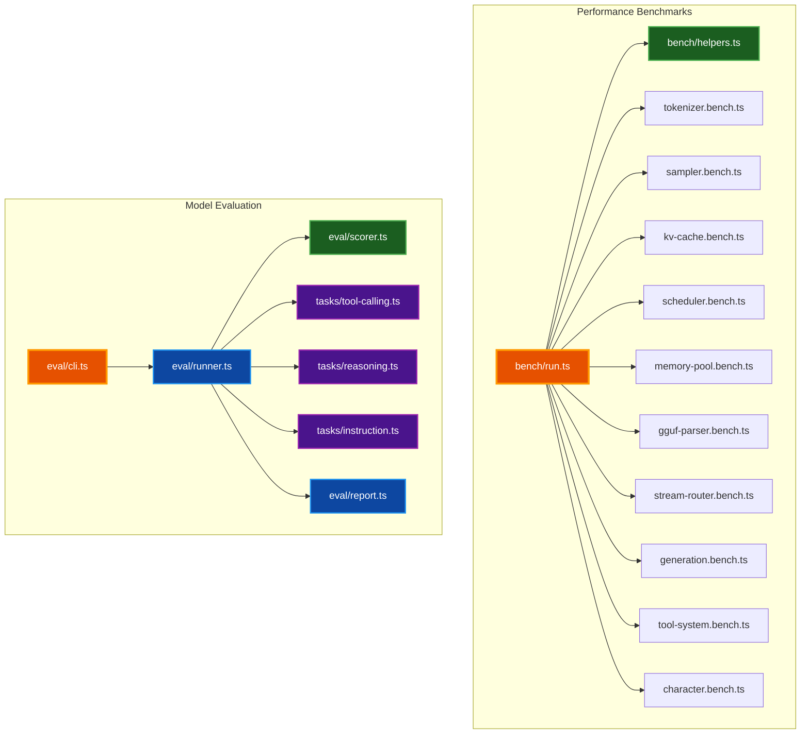
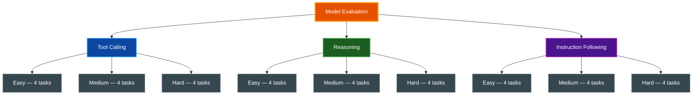

# Benchmarks & Evaluation

Comprehensive guide to WebLLM's performance microbenchmarks and model quality evaluation framework. Use these tools to measure component throughput, track regressions, and assess model capability across tool calling, reasoning, and instruction following.

## Table of Contents

- [Overview](#overview)
- [Architecture](#architecture)
- [Performance Microbenchmarks](#performance-microbenchmarks)
- [Model Quality Evaluation](#model-quality-evaluation)
- [Running Benchmarks](#running-benchmarks)
- [Interpreting Results](#interpreting-results)
- [Adding New Benchmarks](#adding-new-benchmarks)
- [Related Documentation](#related-documentation)

## Overview

WebLLM provides two complementary benchmarking systems:

- **Performance Microbenchmarks** — Measure throughput and latency of individual TypeScript components using mitata
- **Model Quality Evaluation** — Assess model behavior across tool calling accuracy, reasoning ability, and instruction following

Both systems run locally via Bun with no external dependencies beyond `mitata` for microbenchmarking.

## Architecture



## Performance Microbenchmarks

### What Gets Benchmarked

The microbenchmark suite measures pure TypeScript component performance. These do not require GPU/WASM — they test the orchestration layer that wraps the inference engine.

| File | Component | What It Measures |
|------|-----------|-----------------|
| `tokenizer.bench.ts` | `Tokenizer` | BPE/SPM encode at short/medium/long text, token decode |
| `sampler.bench.ts` | `Sampler` | `sample()` at 1K/32K/128K vocab, individual transforms |
| `kv-cache.bench.ts` | `KVCache` | `findSlots` for 1/128 slots, `updateSlots`, `evictSequence`, `sharePromptCells` |
| `scheduler.bench.ts` | `Scheduler` | Enqueue 10/100 tasks, dequeue, `runFrame`, `preemptModel` |
| `memory-pool.bench.ts` | `MemoryPool` | Allocate/free 1000 buffers, `evictForAllocation`, `evictModel`, `getModelUsage` |
| `gguf-parser.bench.ts` | `GgufParser` | Parse minimal/small/medium/large GGUF buffers |
| `stream-router.bench.ts` | `StreamRouter` | Emit to 1/5 consumers, full round-trip |
| `generation.bench.ts` | `Generator` | Generate 50/200 tokens with mock forward pass |
| `tool-system.bench.ts` | `ToolSystem` | `parseToolCall` XML/JSON/negative, `execute`, `formatForPrompt` |
| `character.bench.ts` | `Character` | Construction, chat stub, `getHistory`, `clearHistory` |

### Shared Helpers

`bench/helpers.ts` provides synthetic data generators used across all benchmark files:

- `makeRandomLogits(vocabSize)` — Random `Float32Array` for sampler benchmarks
- `makeBpeTokenData()` — BPE token/merge/vocab maps for tokenizer benchmarks
- `makeSpmTokenData()` — SPM token/score/vocab maps for tokenizer benchmarks
- `makeKVCacheConfig(nLayers, nCells)` — KVCache configuration
- `makePopulatedKVCache(nCells, nSequences)` — Pre-populated KVCache
- `makeMinimalGgufBuffer(metadataCount, tensorCount)` — Synthetic GGUF binary data

### Example Output

```text
benchmark                               avg (min … max)       p75 / p99
------------------------------------------------------- -------------------------------
• BPE encode
short text                              259.15 ns/iter        245.97 ns
medium text                               3.63 µs/iter          3.66 µs
long text                                23.49 µs/iter         22.22 µs

• Sampler (32K vocab)
sample (full pipeline, greedy)          142.31 µs/iter       145.80 µs
applyTemperature                         28.44 µs/iter        29.10 µs
applyTopK (k=40)                         45.67 µs/iter        47.20 µs
```

## Model Quality Evaluation

### Evaluation Dimensions

The evaluation framework tests model quality across three dimensions, each with 12 tasks at three difficulty levels.



#### Tool Calling (`tc-001` through `tc-012`)

Measures the model's ability to produce valid tool calls with correct function names and arguments.

| Difficulty | Tasks | Skills Tested |
|-----------|-------|---------------|
| **Easy** | `tc-001` to `tc-004` | Single tool call, one/multiple params, recognizing when no tool is needed, enum params |
| **Medium** | `tc-005` to `tc-008` | Selecting correct tool from multiple options, optional params, ambiguous input routing, numeric args |
| **Hard** | `tc-009` to `tc-012` | Sequential tool chains, error recovery, product-price chains, rejecting harmful requests |

#### Reasoning (`rs-001` through `rs-012`)

Measures factual knowledge, logical deduction, and mathematical reasoning.

| Difficulty | Tasks | Skills Tested |
|-----------|-------|---------------|
| **Easy** | `rs-001` to `rs-004` | Basic arithmetic, geography, counting, common knowledge |
| **Medium** | `rs-005` to `rs-008` | Syllogistic logic, percentage calculations, decimal comparison, cause-and-effect |
| **Hard** | `rs-009` to `rs-012` | Rate-distance problems, temporal reasoning, trick questions, water jug puzzle |

#### Instruction Following (`in-001` through `in-012`)

Measures format compliance, constraint adherence, and multi-step instruction execution.

| Difficulty | Tasks | Skills Tested |
|-----------|-------|---------------|
| **Easy** | `in-001` to `in-004` | Bullet points, sentence count, prefix constraint, number-only response |
| **Medium** | `in-005` to `in-008` | JSON schema output, numbered lists, required words, forbidden words |
| **Hard** | `in-009` to `in-012` | Multi-constraint formatting, conditional responses, typed JSON, ordered answers |

### Scoring Methods

Each task uses one of eight scoring methods defined in `eval/types.ts`:

| Method | How It Scores | Used For |
|--------|---------------|----------|
| `exact` | Case-insensitive exact match: 1.0 or 0.0 | Precise factual answers |
| `contains` | Substring presence: 1.0 or 0.0 | Checking for specific values in output |
| `regex` | Regex pattern match: 1.0 or 0.0 | Format validation |
| `json_schema` | Field type matching: ratio of correct fields | JSON output validation |
| `tool_call` | Name match (0.5) + arg matching (0.5 × ratio) | Single tool call accuracy |
| `tool_call_chain` | Sequential step matching: ratio of correct steps | Multi-step tool usage |
| `no_tool_call` | Absence of tool call: 1.0 or 0.0 | Recognizing non-tool inputs |
| `custom` | Arbitrary scoring function: 0.0 to 1.0 | Complex multi-constraint checks |

### Report Format

Reports include per-dimension aggregates and individual task results:

```text
Model Evaluation Report
Model: llama-3.2-3b-q4_k_m | 2026-04-20T12:00:00Z

DIMENSION              SCORE    PASSED   AVG LATENCY
tool-calling           0.75     9/12     142ms
reasoning              0.83     10/12    98ms
instruction-following  0.67     8/12     115ms

Overall: 0.75 (27/36 tasks)

FAILURES:
  tc-009  score: 0.00  "Expected tool_call_chain, got single call"
  rs-012  score: 0.50  "Partial: described steps but wrong order"
  in-009  score: 0.33  "1 of 3 constraints met"
```

JSON reports are saved to `eval/reports/<timestamp>-<modelId>.json`.

## Running Benchmarks

### Performance Microbenchmarks

```bash
# Run all performance benchmarks
make bench

# Or via bun directly
bun run bench
```

### Model Quality Evaluation

```bash
# List all 36 evaluation tasks
make bench-eval-list

# Run evaluation against a model (CI mode)
make bench-eval -- --model llama-3.2-3b-q4_k_m

# Run a single dimension
bun run bench:eval --model llama-3.2-3b-q4_k_m --dimension tool-calling

# Interactive mode — pick tasks and see live results
make bench-eval-interactive

# Custom output directory and parameters
bun run bench:eval -m llama-3.2-3b-q4_k_m -o ./my-reports --temperature 0.3 --max-tokens 512
```

### Run Everything

```bash
# Performance + evaluation
make bench-all
```

### CLI Reference

| Flag | Short | Description |
|------|-------|-------------|
| `--model` | `-m` | Model ID to evaluate (required) |
| `--dimension` | `-d` | Run only one dimension (`tool-calling`, `reasoning`, `instruction-following`) |
| `--interactive` | `-i` | Interactive mode with live output |
| `--output` | `-o` | Report output directory (default: `eval/reports`) |
| `--temperature` | `-t` | Override sampling temperature |
| `--max-tokens` | | Override max tokens per task |
| `--timeout` | | Per-task timeout in ms (default: 30000) |
| `--list` | | List all tasks and exit |

## Interpreting Results

### Performance Benchmarks

**Key metrics:**

- **avg (min … max)** — Average iteration time with range
- **p75 / p99** — 75th and 99th percentile latencies
- Higher variance (wide min/max spread) indicates sensitivity to data size or GC pressure

**What to look for:**

- Tokenizer encode should scale linearly with input length
- Sampler cost scales with vocabulary size — the 128K vocab benchmark is the realistic target
- KVCache `findSlots` at 128 slots simulates prompt processing; 1 slot simulates decode step
- GGUF parser cost scales with metadata/tensor count — real models have 200+ KV pairs

### Model Evaluation

**Scoring thresholds:**

| Score Range | Interpretation |
|-------------|---------------|
| 0.9 – 1.0 | Excellent — model handles this consistently |
| 0.7 – 0.9 | Good — reliable on easy/medium, some hard task failures |
| 0.5 – 0.7 | Fair — basic capability, needs prompt engineering for hard tasks |
| Below 0.5 | Poor — model struggles with this dimension |

**Common failure patterns:**

- **Tool calling failures** — Model produces text instead of structured tool calls, or picks wrong tool
- **Reasoning failures** — Model gives confident wrong answers to math/logic, especially trick questions
- **Instruction failures** — Model satisfies some constraints but not all simultaneously

## Adding New Benchmarks

### Adding a Performance Benchmark

1. Create `bench/<component>.bench.ts`
2. Import from `mitata` and the target source module
3. Use `group()` to organize related benchmarks
4. Import the file in `bench/run.ts`

```typescript
import { bench, group } from "mitata";
import { MyComponent } from "../src/my-module.js";
import { makeMyData } from "./helpers.js";

group("my-component", () => {
  bench("operation (small)", () => {
    const data = makeMyData(100);
    MyComponent.process(data);
  });

  bench("operation (large)", () => {
    const data = makeMyData(10000);
    MyComponent.process(data);
  });
});
```

### Adding an Evaluation Task

1. Add tasks to the appropriate file in `eval/tasks/`
2. Choose the right `ScoringMethod` for your task
3. Define tools with canned responses if the task requires tool calling
4. Run `bun run bench:eval --list` to verify the task appears

```typescript
export const myTasks: EvalTask[] = [
  {
    id: "my-001",
    dimension: "tool-calling",
    description: "Description of what this tests",
    systemPrompt: "You are a helpful assistant with access to tools.",
    input: "User message that should trigger a tool call",
    expected: "Expected model behavior description",
    scoring: { type: "tool_call", expectedName: "my_tool" },
    tools: [{
      name: "my_tool",
      description: "What the tool does",
      parameters: { arg1: { type: "string", required: true } },
      response: { result: "canned response" },
    }],
    difficulty: "easy",
  },
];
```

**Important:** Register the task array in `eval/cli.ts` by importing and spreading it into the `allTasks` array.

## Related Documentation

- [README.md](../README.md) — Project overview and quick start
- [DOCUMENTATION_STYLE_GUIDE.md](DOCUMENTATION_STYLE_GUIDE.md) — Documentation standards
- `eval/types.ts` — Evaluation type definitions
- `eval/scorer.ts` — Scoring engine implementation
