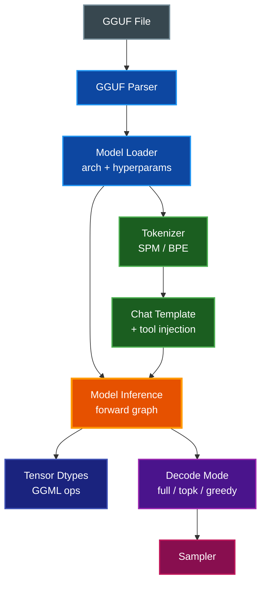

# Model Support

What the browser-side inference pipeline supports today, what it refuses, and
what it would take to close each gap. Audience: contributors adding a new
model, quantization, or chat variant.

## Table of Contents

- [Overview](#overview)
- [Support Layers](#support-layers)
- [Supported Today](#supported-today)
  - [Container Format](#container-format)
  - [Architectures](#architectures)
  - [Quantization Types](#quantization-types)
  - [Tokenizers](#tokenizers)
  - [Chat Templates](#chat-templates)
  - [Tool Calling](#tool-calling)
  - [Decode Modes](#decode-modes)
  - [Embeddings](#embeddings)
  - [Registered Models](#registered-models)
- [Work Needed](#work-needed)
  - [New Architectures](#new-architectures)
  - [New Quantization Types](#new-quantization-types)
  - [Alternate Container Formats](#alternate-container-formats)
  - [Mixture of Experts](#mixture-of-experts)
  - [Long-Context RoPE Variants](#long-context-rope-variants)
  - [Multimodal Inputs](#multimodal-inputs)
  - [Tool Calling on Other Templates](#tool-calling-on-other-templates)
- [How to Add Support](#how-to-add-support)
  - [Adding an Architecture](#adding-an-architecture)
  - [Adding a Quantization Type](#adding-a-quantization-type)
  - [Adding a Chat Template](#adding-a-chat-template)
- [Related Documentation](#related-documentation)

## Overview

Inference goes: **GGUF file → parser → architecture-aware forward graph →
WebGPU backend → sampled token**. Every layer in that chain has a closed set
of things it understands; "supporting a new model" means checking that each
layer already handles what the model needs, or adding the missing case.

The bulk of the code that decides what is and isn't supported lives in:

- `src/models/gguf-parser.ts` — container
- `src/models/model-loader.ts` — metadata → hyperparams, tokenizer, KV cache
- `src/inference/model-inference.ts` — forward graph, decode modes
- `src/inference/chat-template.ts` — prompt rendering
- `src/inference/tokenizer.ts` — tokenization
- `src/inference/ggml-wasm.ts` — tensor dtypes and GGML op bindings
- `eval/models.ts` — registered models used by smoke tests and benches

## Support Layers



## Supported Today

### Container Format

Only **GGUF**. The parser in `src/models/gguf-parser.ts` reads the metadata
dictionary and tensor table directly out of an `ArrayBuffer` shipped from the
browser fetch path — no native MLC package, no safetensors, no PyTorch state
dicts.

### Architectures

The `ModelArchitecture` union in `src/core/types.ts` declares the set.
`getRopeModeForArchitecture` in `src/inference/model-inference.ts` is the main
place architecture branches: qwen uses NEOX RoPE layout, everything else uses
NORMAL. The encoder vs. causal-embedder vs. causal-LM split is dispatched in
`engine.embed()` via `isEncoderArchitecture` / `isCausalEmbedderArchitecture`
(see [Embeddings](#encoder-forward-pass-for-the-embedding-track)).

| Architecture | Status | Notes |
|--------------|--------|-------|
| `llama` | Supported | Llama 3/3.2, Llama 3.1 8B, SmolLM2, TinyLlama, Hermes-3 |
| `qwen` | Supported | Qwen2.5, Qwen2.5-Coder, Qwen3 family (0.6B–14B incl. 8B); NEOX RoPE |
| `mistral` | Supported | Mistral-7B-Instruct-v0.3 (Q4_K_S canonical + Q3_K_M / Q5_K_M / IQ4_XS probes), Mistral-Nemo-12B |
| `phi3` | Supported | Phi-3.5-Mini (fused QKV, fused gate-up FFN). `phi` is reserved for Phi-1/Phi-2 |
| `gemma` | Supported | Gemma 2 2B IT (logit/attn soft-cap, sliding-window, (1+w) RMSNorm) |
| `gemma4` | Supported | Gemma 4 E2B (PLE + dual-RoPE + shared-KV + SWA + QK-norm; closed 2026-05-12) |
| `bert` | Supported (encoder) | Snowflake Arctic-Embed S/M, BGE small/large — bidirectional, CLS/mean pooling |
| `nomic-bert` | Supported (encoder) | Nomic Embed Text v1.5 |
| `jina-bert-v2` | Supported (encoder) | Jina Embeddings v2 Base EN (ALiBi bias) |
| `qwen3-embedding` | Supported (causal-embedder) | Qwen3-Embedding 0.6B (hybrid quant), last-token pooling |

Architectures in the union but not yet exercised by a registered model
(`gemma2`, `gemma3`, `mixtral`, `deepseek`) currently fall through the
parser's fallback and are read as their nearest registered cousin — usually
they load but generate garbage, and some crash during forward when tensor
names don't match the expected layout.

### Quantization Types

The WASM build exports a fixed set of GGML type IDs via
`src/inference/ggml-wasm.ts`. Unregistered type IDs abort at weight-load time.

| Family | Types | Used By |
|--------|-------|---------|
| Float | `F32`, `F16`, `BF16` | Embedding models, scales |
| Integer | `I32` | Positions, token IDs |
| Legacy quant | `Q4_0`, `Q4_1`, `Q5_0`, `Q5_1`, `Q8_0`, `Q8_1` | Legacy GGUF exports; wave-1 fleet pins Q4_0 for cross-family GEMV parity |
| K-quant | `Q2_K`, `Q3_K`, `Q4_K`, `Q5_K`, `Q6_K`, `Q8_K` | Modern `q4f16` / `q4km` / `q5km` builds; Q3_K correctness restored by patch 11 |
| I-quant | `IQ2_XXS`, `IQ2_XS`, `IQ2_S`, `IQ3_XXS`, `IQ3_S`, `IQ4_NL`, `IQ4_XS` | IQ3_M (`IQ3_S` tensors) and IQ4_XS are canonical fleet quants |
| Hybrid | `Q4_K` token_embd + `F16` body | Per-binding 128 MiB cap workaround for large-vocab embedders (Qwen3-Embedding) |

In practice the production path is `q4f16` (Q4_K weights with FP16 scales).
IQ3_M is a first-class `QuantFormat` (`"iq3m"` in `eval/models.ts`) with two
canonical 8B fleet members (`llama-3.1-8b-instruct-iq3m`, `qwen3-8b-iq3m`),
and Mistral-7B-Instruct-v0.3 ships an IQ4_XS probe. Q3_K_M is coherent
post-patch-11 (UB shift-by-32 fix in `load_u32_at_src`). F32/F16 covers the
encoder embedding models. See `eval/models.ts`.

> **Note:** Adding a new quantization type requires changes in the local
> `llama.cpp` branch and a rebuild, not just TypeScript edits. See
> [docs/LLAMA_CPP_PATCHES.md](LLAMA_CPP_PATCHES.md).

### Tokenizers

`src/inference/tokenizer.ts` picks an implementation from GGUF's
`tokenizer.ggml.model` key:

- **SPM** (SentencePiece) — llama family
- **BPE** (GPT-2 style) — qwen, gemma, phi, and anything else declaring `gpt2`

Both use the merges and scores from GGUF metadata. There is no HuggingFace
`tokenizer.json` fallback — a model whose tokenizer metadata isn't one of
these two will not tokenize correctly.

### Chat Templates

`detectChatTemplate` in `src/inference/chat-template.ts` picks a formatter
based on marker strings found in the GGUF `tokenizer.chat_template`.

| Template | Detection signal | Status |
|----------|------------------|--------|
| `chatml` | `<\|im_start\|>` | Rendered + tool injection |
| `llama3` | `<\|start_header_id\|>` | Rendered + tool injection |
| `llama2` | `[INST]` / `<<SYS>>` | Rendered only |
| `gemma` | `<start_of_turn>` | Rendered only |
| `phi3` | `<\|assistant\|>` + `<\|end\|>` | Rendered only |
| `mistral-v7` | `[SYSTEM_PROMPT]` | Rendered only |
| `zephyr` | `<\|assistant\|>` without `<\|end\|>` | Rendered only |
| `unknown` | fallback | Falls through to `zephyr` format |

"Rendered only" means messages and system prompts work but tool schemas are
silently dropped from the prompt.

### Tool Calling

Tools are injected as a `<tools>…</tools>` JSON-lines block plus instructions
to emit `<tool_call>{"name":…,"arguments":…}</tool_call>`. `ToolSystem` in
`src/characters/tool-system.ts` parses both that XML form and a legacy
`<tool_call={...}>` one-liner.

| Template | Injects tool schemas | Parses tool calls |
|----------|---------------------|-------------------|
| `chatml` | Yes | Yes |
| `llama3` | Yes | Yes |
| `llama2` / `gemma` / `phi3` / `mistral-v7` / `zephyr` | No | Yes (if model emits the expected XML anyway) |

### Decode Modes

Chosen per-step by `generateTextStream` in `src/inference/generation.ts`
based on sampler settings and whether tokens need steering.

| Mode | When it's used | Readback per step |
|------|----------------|-------------------|
| `full` | Thinking-mode token masking, repetition penalty, visible-answer gates | `vocab_size` floats |
| `topk` | Plain top-K + top-P sampling | `topK` int/float pairs |
| `greedy` | Temperature 0 and no repetition penalty | One int |

Only Qwen's thinking path currently triggers `full`; everything else that
samples with top-K takes `topk`; temperature-0 regression tests take `greedy`.

### Embeddings

`engine.embed(modelId, text)` returns an L2-normalized `Float32Array` and
dispatches across three tiers in priority order. Which tier fires is decided
by the model's architecture and registration flags, not by the caller.

| Tier | Engine kind | Gate | Example models |
|------|-------------|------|----------------|
| 1 — Encoder | `EncoderInference` (`bert`, `nomic-bert`, `jina-bert-v2`) | `ENCODER_ARCHITECTURES` membership | Arctic-Embed S/M, BGE small/large, Nomic, Jina v2 |
| 2 — Causal-embedder | `CausalLMEmbedder` (`qwen3-embedding`) | `CAUSAL_EMBEDDER_ARCHITECTURES` membership | Qwen3-Embedding 0.6B (hybrid quant) |
| 3 — Chat-model tap (bucket D) | `ModelInference.embed()` | `embeddingCapable: true` in `eval/models.ts` + `ModelLoadOptions` | `qwen3-8b-iq3m` |

Tier 1 runs a bidirectional BERT-style forward (no causal mask, no KV cache,
single pass) implemented in `src/inference/encoder-inference.ts` with CLS or
mean pooling per the model's `poolingType`. Tier 2 runs a causal-LM forward
without a KV cache and last-token-pools, implemented in
`src/inference/causal-embedder-inference.ts`. Tier 3 taps the
post-`output_norm` hidden state of an already-loaded chat model
(last-token or mean pooling via `embeddingPooling`), letting a single
loaded model serve both chat and embedding queries — significant VRAM
savings on the 16 GB floor at a 5-15% MTEB quality delta vs a dedicated
embedder.

Tier 3 is opt-in per model: set `embeddingCapable: true` in the
`eval/models.ts` registration entry only after the bucket D parity gate
passes (`cos >= 0.999` for q4f16/q0f16, `cos >= 0.995` for hybrid,
`cos >= 0.90` for IQ3_M, each measured against a PyTorch f16 reference).
Phi-3.5-Mini was probed and deliberately **not** enabled — its Q4_K_M
quant noise compounds with high last-token anisotropy, producing
semantically random vectors (see
`eval/reports/bucket-d-phi3-parity-2026-04-30/SUMMARY.md`). The closure
report and full parity data for the shipped tier-3 fleet live at
`eval/reports/bucket-d-parity-2026-04-29/SUMMARY.md`.

The embedding eval dimension (`eval/tasks/embedding.ts`, 8 tasks) scores
via cosine similarity and exercises whichever tier the registered model
dispatches to.

### Registered Models

The canonical source of truth is `eval/models.ts` — 30 models ship today,
exercised by the smoke matrix and full bench. Per-model rows rot quickly, so
do not transcribe the list here. Enumerate the live set instead:

```bash
make bench-eval-models        # list id, params, VRAM, caps, license
# or read eval/models.ts directly
```

The architecture-family breakdown (families change rarely; this table is
stable) at the time of writing:

| Family | Architecture | Registered models | Role |
|--------|--------------|------------------|------|
| Llama 3.x / SmolLM2 / TinyLlama / Hermes 3 | `llama` | 7 | Chat (incl. Llama-3.1-8B IQ3_M) |
| Qwen2.5 / Qwen2.5-Coder / Qwen3 | `qwen` | 8 | Chat + tool calling (incl. Qwen3-8B IQ3 M, Qwen3-14B) |
| Mistral | `mistral` | 5 | Chat (7B Q4_K_S canonical + Q3_K_M/Q5_K_M/IQ4_XS probes; Nemo-12B) |
| Phi | `phi3` | 1 | Chat (Phi-3.5-Mini Q4_K_M, fused-forward) |
| Gemma 2 / Gemma 4 | `gemma`, `gemma4` | 2 | Chat (Gemma-2-2B; Gemma-4-E2B PLE+dual-RoPE+SWA) |
| Arctic-Embed / BGE | `bert` | 4 | Encoder embeddings (F32/F16) |
| Jina Embeddings v2 | `jina-bert-v2` | 1 | Encoder embeddings (ALiBi) |
| Nomic Embed Text | `nomic-bert` | 1 | Encoder embeddings |
| Qwen3-Embedding | `qwen3-embedding` | 1 | Causal-embedder (hybrid quant) |

Mistral-7B-Instruct-v0.3 (`mistral-7b-instruct-v0.3-q4ks`) is a member of
the canonical 6-model ship-gate fleet — registered, not "declared only".

## Work Needed

### New Architectures

A model whose `general.architecture` GGUF field is outside the declared
`ModelArchitecture` union will be cast to it unchecked. Three outcomes are
possible:

1. **Tensor names match the llama layout** — loads and runs, usually fine.
2. **Tensor names differ** — weight loader throws at startup.
3. **Tensor names match but semantics differ** (e.g. DeepSeek's MLA, Command-R's
   shared Q/K/V) — loads, computes, produces garbage.

Adding an architecture cleanly is a multi-file change. See
[Adding an Architecture](#adding-an-architecture) below for the concrete steps.

### New Quantization Types

The WASM build exposes the GGML types enumerated in `src/inference/ggml-wasm.ts`
and `GgmlType` in `src/core/types.ts`. Most i-quants already work — `IQ3_S`
(the tensor type behind IQ3_M) and `IQ4_XS` are canonical fleet quants with
registered models (`llama-3.1-8b-instruct-iq3m`, `qwen3-8b-iq3m`,
`mistral-7b-instruct-v0.3-iq4xs`). Anything genuinely absent from that list —
**ternary** (`TQ1_0`, `TQ2_0`), **MXFP4**, or smaller i-quants not yet
exercised (`IQ1_S`, `IQ2_XXS`, `IQ2_XS`, `IQ2_S`, `IQ3_XXS`, `IQ4_NL`) —
will fail at weight load: either the GGUF type ID is unknown to
`ggml-webgpu`, or the WebGPU backend has no shader for it.

Adding one of these requires:

- A WGSL kernel in the local llama.cpp `webllm-browser-patches` branch
  that can dequantize (or mul_mat directly from) the new format
- Rebuild the WASM via `make wasm-build`
- Update `GgmlType` in `src/inference/ggml-wasm.ts` with the new type ID
- Add a model to `eval/models.ts` that actually exercises it

> **Warning:** Dequant-on-read is cheap to add but slow. Direct
> `mul_mat(quant, F32)` kernels are what makes q4f16 performant; plan on
> writing both paths.

### Alternate Container Formats

Non-GGUF inputs — safetensors, MLC packages, raw PyTorch state dicts — are
not parseable today. Adding one means writing a new parser that emits the
same `ParsedModel` shape the rest of the stack already consumes. Tokenizer
config, chat template, and hyperparameters all come from GGUF metadata keys;
a new parser has to fabricate equivalents from whatever the source format
provides (e.g. a separate `tokenizer.json`).

### Mixture of Experts

`extractHyperparams` in `src/models/model-loader.ts` already reads
`expert_count` and `expert_used_count`. Nothing downstream uses them. The
forward graph is pure dense — there is no gate projection, no expert
routing, no per-token expert dispatch. Running Mixtral, DeepSeek-V2, or any
MoE model right now loads the weights and then computes an incorrect dense
pass.

What would need to land:

- Gate and expert weight loading in `ModelInference.loadWeights`
- Top-K expert selection per token in the forward graph
- Sparse `mul_mat` dispatch (or a scatter/gather over expert outputs)
- KV cache unchanged — it's per-layer, not per-expert

### Long-Context RoPE Variants

The current RoPE path uses `ropeFreqBase` and `ropeScale` with the standard
`NORMAL` / `NEOX` layout. Long-context extensions —
**YaRN**, **NTK-aware**, **LongRoPE**, **Phi3's longrope** — need extra
parameters (original context length, attention factor, per-frequency
scaling table) that aren't plumbed through `ModelHyperparams`. Using one of
those models today falls back to plain linear scaling, which works up to
the base context but degrades sharply past it.

### Multimodal Inputs

Pure text only. Vision (Llava, Qwen-VL), audio (Whisper), and interleaved
multimodal models all require:

- An image/audio encoder (separate compute graph)
- A projector from encoder output to language-model embedding space
- Extended prompt rendering that splices encoded embeddings into the token
  stream
- Input API changes — `Character.chat(input: string)` has no slot for
  non-text content

Estimated scope: new codepath, not a bolt-on.

### Tool Calling on Other Templates

`formatLlama2`, `formatGemma`, `formatPhi3`, `formatMistralV7`, and
`formatZephyr` ignore `options.tools`. Any model using one of these
templates scores poorly on tool-calling benches. The fix per-template is
usually five lines — the same `injectToolsIntoSystem` call that `chatml`
and `llama3` already use. Gemma and Mistral have their own native tool-call
conventions; if preserving those matters, the template formatters need
model-specific serializers rather than the generic `<tool_call>` XML.

## How to Add Support

### Adding an Architecture

**When the new architecture is llama-shaped** (same projection layout, same
norm kind, just a different RoPE variant or tensor naming quirk):

1. **Add the identifier** to the `ModelArchitecture` union in
   `src/core/types.ts`.
2. **Branch RoPE** in `getRopeModeForArchitecture` if the new architecture
   uses a different layout. Otherwise it falls through to `NORMAL`.
3. **Verify tensor names** by running the model through the smoke page with
   console logging — mismatches show up as thrown errors during
   `loadWeights`. Add aliases where naming differs.
4. **Register a test model** in `eval/models.ts` pointing at a GGUF you
   trust.
5. **Run** `make smoke-test` and open the real-model page for that model in
   Chrome. A working prefill + decode produces sensible top-10 tokens in
   the smoke log.

**When the architecture needs new graph shapes** (MLA, grouped-query with
shared projections, novel normalization), plan on editing
`ModelInference.forward` and `ModelInference.forwardDecode` directly. There
is no per-architecture plugin system — the graph is written inline.

### Adding a Quantization Type

1. **Patch the local llama.cpp branch** with WGSL kernels for the new type.
   See [docs/LLAMA_CPP_PATCHES.md](LLAMA_CPP_PATCHES.md) for the rebase
   procedure.
2. **Rebuild WASM**: `make wasm-build`. For diagnostic builds while chasing
   aborts, use `make wasm-build-debug` (preserves `GGML_ASSERT` messages).
3. **Register the type** in `GgmlType` (`src/inference/ggml-wasm.ts`) with
   the GGML type ID from `ggml.h`.
4. **Add a model** in `eval/models.ts` using the new quant.
5. **Bench it** with `bun run eval/browser-eval.ts --model <id>` against
   the live dashboard to confirm accuracy holds.

### Adding a Chat Template

1. **Detect it** in `detectChatTemplate` in
   `src/inference/chat-template.ts` by a marker string from the raw template.
2. **Write the formatter** — same signature as the existing ones. If the
   model supports tool calls, reuse `injectToolsIntoSystem` for the generic
   `<tool_call>` contract, or write a model-specific serializer if the
   model's training data uses a different convention.
3. **Register** the formatter in the `FORMATTERS` record and extend the
   `ChatTemplateType` union.
4. **Add unit tests** under `tests/` covering basic rendering, system
   injection, and (if applicable) tool injection. Tests in
   `tests/chat-template.test.ts` show the pattern.
5. **Mirror in the smoke page** — the browser smoke test constructs its
   chat prompt the same way; run it through `make smoke-test` to confirm.

## Related Documentation

- [README.md](../README.md) — project overview, public API, benchmark surface
- [docs/BENCHMARKS.md](BENCHMARKS.md) — eval methodology and metrics
- [docs/LLAMA_CPP_PATCHES.md](LLAMA_CPP_PATCHES.md) — local patch inventory
  and rebase procedure
- [CLAUDE.md](../CLAUDE.md) — repo guidance and regression lessons
