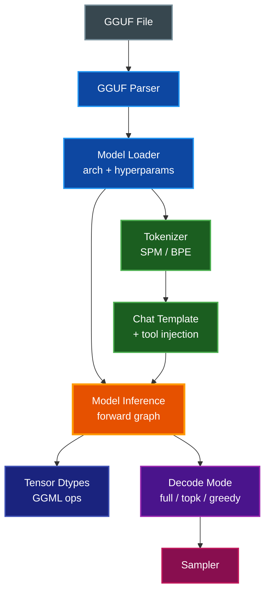

# Model Support

What the browser-side inference pipeline supports today, what it refuses, and
what it would take to close each gap. Audience: contributors adding a new
model, quantization, or chat variant.

## Table of Contents

- [Overview](#overview)
- [Support Layers](#support-layers)
- [Supported Today](#supported-today)
  - [Container Format](#container-format)
  - [Architectures](#architectures)
  - [Quantization Types](#quantization-types)
  - [Tokenizers](#tokenizers)
  - [Chat Templates](#chat-templates)
  - [Tool Calling](#tool-calling)
  - [Decode Modes](#decode-modes)
  - [Registered Models](#registered-models)
- [Work Needed](#work-needed)
  - [New Architectures](#new-architectures)
  - [New Quantization Types](#new-quantization-types)
  - [Alternate Container Formats](#alternate-container-formats)
  - [Mixture of Experts](#mixture-of-experts)
  - [Long-Context RoPE Variants](#long-context-rope-variants)
  - [Multimodal Inputs](#multimodal-inputs)
  - [Tool Calling on Other Templates](#tool-calling-on-other-templates)
- [How to Add Support](#how-to-add-support)
  - [Adding an Architecture](#adding-an-architecture)
  - [Adding a Quantization Type](#adding-a-quantization-type)
  - [Adding a Chat Template](#adding-a-chat-template)
- [Related Documentation](#related-documentation)

## Overview

Inference goes: **GGUF file → parser → architecture-aware forward graph →
WebGPU backend → sampled token**. Every layer in that chain has a closed set
of things it understands; "supporting a new model" means checking that each
layer already handles what the model needs, or adding the missing case.

The bulk of the code that decides what is and isn't supported lives in:

- `src/models/gguf-parser.ts` — container
- `src/models/model-loader.ts` — metadata → hyperparams, tokenizer, KV cache
- `src/inference/model-inference.ts` — forward graph, decode modes
- `src/inference/chat-template.ts` — prompt rendering
- `src/inference/tokenizer.ts` — tokenization
- `src/inference/ggml-wasm.ts` — tensor dtypes and GGML op bindings
- `eval/models.ts` — registered models used by smoke tests and benches

## Support Layers

## Supported Today

### Container Format

Only **GGUF**. The parser in `src/models/gguf-parser.ts` reads the metadata
dictionary and tensor table directly out of an `ArrayBuffer` shipped from the
browser fetch path — no native MLC package, no safetensors, no PyTorch state
dicts.

### Architectures

The `ModelArchitecture` union in `src/core/types.ts` declares the set.
`getRopeModeForArchitecture` in `src/inference/model-inference.ts` is the main
place architecture branches: qwen uses NEOX RoPE layout, everything else uses
NORMAL.

| Architecture | Status | Notes |
|--------------|--------|-------|
| `llama` | Supported | Llama 3/3.2, SmolLM2, TinyLlama, Hermes-3 |
| `qwen` | Supported | Qwen2.5, Qwen2.5-Coder, Qwen3 (NEOX RoPE) |
| `gemma` | Supported | Gemma 2 |
| `phi` | Supported | Phi-3.5-Mini |
| `mistral` | Declared only | No registered model; forward path untested |

Architectures beyond this list currently fall through the parser's fallback
and are read as generic llama — usually they load but generate garbage, and
some crash during forward when tensor names don't match the expected layout.

### Quantization Types

The WASM build exports a fixed set of GGML type IDs via
`src/inference/ggml-wasm.ts`. Unregistered type IDs abort at weight-load time.

| Family | Types | Used By |
|--------|-------|---------|
| Float | `F32`, `F16`, `BF16` | Embedding models, scales |
| Integer | `I32` | Positions, token IDs |
| Legacy quant | `Q4_0`, `Q4_1`, `Q5_0`, `Q5_1`, `Q8_0`, `Q8_1` | Legacy GGUF exports |
| K-quant | `Q2_K`, `Q3_K`, `Q4_K`, `Q5_K`, `Q6_K`, `Q8_K` | Modern `q4f16` / `q5f16` builds |

In practice the production path is `q4f16` (Q4_K weights with FP16 scales),
with Q4_0 on one legacy entry and F32 on the Arctic-Embed embedding models.
See `eval/models.ts`.

> **📝 Note:** Adding a new quantization type requires changes in the local
> `llama.cpp` branch and a rebuild, not just TypeScript edits. See
> [docs/LLAMA_CPP_PATCHES.md](LLAMA_CPP_PATCHES.md).

### Tokenizers

`src/inference/tokenizer.ts` picks an implementation from GGUF's
`tokenizer.ggml.model` key:

- **SPM** (SentencePiece) — llama family
- **BPE** (GPT-2 style) — qwen, gemma, phi, and anything else declaring `gpt2`

Both use the merges and scores from GGUF metadata. There is no HuggingFace
`tokenizer.json` fallback — a model whose tokenizer metadata isn't one of
these two will not tokenize correctly.

### Chat Templates

`detectChatTemplate` in `src/inference/chat-template.ts` picks a formatter
based on marker strings found in the GGUF `tokenizer.chat_template`.

| Template | Detection signal | Status |
|----------|------------------|--------|
| `chatml` | `<\|im_start\|>` | Rendered + tool injection |
| `llama3` | `<\|start_header_id\|>` | Rendered + tool injection |
| `llama2` | `[INST]` / `<<SYS>>` | Rendered only |
| `gemma` | `<start_of_turn>` | Rendered only |
| `phi3` | `<\|assistant\|>` + `<\|end\|>` | Rendered only |
| `mistral-v7` | `[SYSTEM_PROMPT]` | Rendered only |
| `zephyr` | `<\|assistant\|>` without `<\|end\|>` | Rendered only |
| `unknown` | fallback | Falls through to `zephyr` format |

"Rendered only" means messages and system prompts work but tool schemas are
silently dropped from the prompt.

### Tool Calling

Tools are injected as a `<tools>…</tools>` JSON-lines block plus instructions
to emit `<tool_call>{"name":…,"arguments":…}</tool_call>`. `ToolSystem` in
`src/characters/tool-system.ts` parses both that XML form and a legacy
`<tool_call={...}>` one-liner.

| Template | Injects tool schemas | Parses tool calls |
|----------|---------------------|-------------------|
| `chatml` | Yes | Yes |
| `llama3` | Yes | Yes |
| `llama2` / `gemma` / `phi3` / `mistral-v7` / `zephyr` | No | Yes (if model emits the expected XML anyway) |

### Decode Modes

Chosen per-step by `generateTextStream` in `src/inference/generation.ts`
based on sampler settings and whether tokens need steering.

| Mode | When it's used | Readback per step |
|------|----------------|-------------------|
| `full` | Thinking-mode token masking, repetition penalty, visible-answer gates | `vocab_size` floats |
| `topk` | Plain top-K + top-P sampling | `topK` int/float pairs |
| `greedy` | Temperature 0 and no repetition penalty | One int |

Only Qwen's thinking path currently triggers `full`; everything else that
samples with top-K takes `topk`; temperature-0 regression tests take `greedy`.

### Registered Models

14 models ship in `eval/models.ts` and are exercised by the smoke matrix and
full bench. Dimensions match `src/core/types.ts`.

| Family | Model ID | Quant |
|--------|----------|-------|
| Llama | `smollm2-360m-q4f16`, `smollm2-1.7b-q4f16`, `llama-3.2-1b-q4f16`, `llama-3.2-3b-q4f16`, `hermes-3-llama-3.2-3b-q4f16`, `tinyllama-1.1b-chat-q4_0` | Q4_K-F16 (one Q4_0) |
| Qwen | `qwen3-0.6b-q4f16`, `qwen3-1.7b-q4f16`, `qwen3-4b-q4f16`, `qwen2.5-1.5b-q4f16`, `qwen2.5-3b-q4f16`, `qwen2.5-coder-1.5b-q4f16` | Q4_K-F16 |
| Phi | `phi-3.5-mini-q4f16` | Q4_K-F16 |
| Gemma | `gemma-2-2b-q4f16` | Q4_K-F16 |
| Embedding (Llama) | `snowflake-arctic-embed-s-q0f32-b4`, `snowflake-arctic-embed-m-q0f32-b4` | F32 |

## Work Needed

### New Architectures

A model whose `general.architecture` GGUF field is outside the declared
`ModelArchitecture` union will be cast to it unchecked. Three outcomes are
possible:

1. **Tensor names match the llama layout** — loads and runs, usually fine.
2. **Tensor names differ** — weight loader throws at startup.
3. **Tensor names match but semantics differ** (e.g. DeepSeek's MLA, Command-R's
   shared Q/K/V) — loads, computes, produces garbage.

Adding an architecture cleanly is a multi-file change. See
[Adding an Architecture](#adding-an-architecture) below for the concrete steps.

### New Quantization Types

The WASM build only exposes the GGML types enumerated above. Anything not in
that list — **i-quants** (`IQ2_XS`, `IQ3_XXS`, `IQ4_NL`, …), **ternary**
(`TQ1_0`, `TQ2_0`), **MXFP4** — will fail at weight load: either the GGUF
type ID is unknown to `ggml-webgpu`, or the WebGPU backend has no shader for
it.

Adding one of these requires:

- A WGSL kernel in the local llama.cpp `webllm-browser-patches` branch
  that can dequantize (or mul_mat directly from) the new format
- Rebuild the WASM via `make wasm-build`
- Update `GgmlType` in `src/inference/ggml-wasm.ts` with the new type ID
- Add a model to `eval/models.ts` that actually exercises it

> **⚠️ Warning:** Dequant-on-read is cheap to add but slow. Direct
> `mul_mat(quant, F32)` kernels are what makes q4f16 performant; plan on
> writing both paths.

### Alternate Container Formats

Non-GGUF inputs — safetensors, MLC packages, raw PyTorch state dicts — are
not parseable today. Adding one means writing a new parser that emits the
same `ParsedModel` shape the rest of the stack already consumes. Tokenizer
config, chat template, and hyperparameters all come from GGUF metadata keys;
a new parser has to fabricate equivalents from whatever the source format
provides (e.g. a separate `tokenizer.json`).

### Mixture of Experts

`extractHyperparams` in `src/models/model-loader.ts` already reads
`expert_count` and `expert_used_count`. Nothing downstream uses them. The
forward graph is pure dense — there is no gate projection, no expert
routing, no per-token expert dispatch. Running Mixtral, DeepSeek-V2, or any
MoE model right now loads the weights and then computes an incorrect dense
pass.

What would need to land:

- Gate and expert weight loading in `ModelInference.loadWeights`
- Top-K expert selection per token in the forward graph
- Sparse `mul_mat` dispatch (or a scatter/gather over expert outputs)
- KV cache unchanged — it's per-layer, not per-expert

### Long-Context RoPE Variants

The current RoPE path uses `ropeFreqBase` and `ropeScale` with the standard
`NORMAL` / `NEOX` layout. Long-context extensions —
**YaRN**, **NTK-aware**, **LongRoPE**, **Phi3's longrope** — need extra
parameters (original context length, attention factor, per-frequency
scaling table) that aren't plumbed through `ModelHyperparams`. Using one of
those models today falls back to plain linear scaling, which works up to
the base context but degrades sharply past it.

### Encoder Forward Pass for the Embedding Track

The `embedding` dimension scores by cosine similarity between two vectors
produced by `engine.embed(modelId, text)`. The scoring primitive
(`scoreCosineSimilarity` in `src/evaluation/scorer.ts`) and the task set
(`eval/tasks/embedding.ts`) are in place; what's missing is the encoder
itself. The `snowflake-arctic-embed-*` models in `eval/models.ts` declare
`capabilities.embedding: true` but there's no BERT-style forward pass in
`ModelInference` to actually produce the vectors.

What needs to land:

- **Encoder graph** — bidirectional attention (no causal mask), no KV
  cache, single-pass over the full input. Arctic-Embed is BERT-small/medium
  with RoPE disabled and absolute positional embeddings.
- **Pooling** — CLS token embedding or mean pooling over the last hidden
  state, matching the model's training.
- **Public API** — `WebLLM.embed(modelId, text): Promise<Float32Array>`
  that tokenizes, runs the encoder, pools, and L2-normalizes.
- **Architecture branch** — the model loader currently maps everything to
  the causal-LM layout; BERT-style models need their own weight layout and
  `ModelInference` entry point.

Until that lands, `--dimension embedding` is auto-skipped on every
registered model. Explicit `--dimension embedding` raises the
not-implemented error from whatever path was stubbed so the gap is
visible during debugging.

### Multimodal Inputs

Pure text only. Vision (Llava, Qwen-VL), audio (Whisper), and interleaved
multimodal models all require:

- An image/audio encoder (separate compute graph)
- A projector from encoder output to language-model embedding space
- Extended prompt rendering that splices encoded embeddings into the token
  stream
- Input API changes — `Character.chat(input: string)` has no slot for
  non-text content

Estimated scope: new codepath, not a bolt-on.

### Tool Calling on Other Templates

`formatLlama2`, `formatGemma`, `formatPhi3`, `formatMistralV7`, and
`formatZephyr` ignore `options.tools`. Any model using one of these
templates scores poorly on tool-calling benches. The fix per-template is
usually five lines — the same `injectToolsIntoSystem` call that `chatml`
and `llama3` already use. Gemma and Mistral have their own native tool-call
conventions; if preserving those matters, the template formatters need
model-specific serializers rather than the generic `<tool_call>` XML.

## How to Add Support

### Adding an Architecture

**When the new architecture is llama-shaped** (same projection layout, same
norm kind, just a different RoPE variant or tensor naming quirk):

1. **Add the identifier** to the `ModelArchitecture` union in
   `src/core/types.ts`.
2. **Branch RoPE** in `getRopeModeForArchitecture` if the new architecture
   uses a different layout. Otherwise it falls through to `NORMAL`.
3. **Verify tensor names** by running the model through the smoke page with
   console logging — mismatches show up as thrown errors during
   `loadWeights`. Add aliases where naming differs.
4. **Register a test model** in `eval/models.ts` pointing at a GGUF you
   trust.
5. **Run** `make smoke-test` and open the real-model page for that model in
   Chrome. A working prefill + decode produces sensible top-10 tokens in
   the smoke log.

**When the architecture needs new graph shapes** (MLA, grouped-query with
shared projections, novel normalization), plan on editing
`ModelInference.forward` and `ModelInference.forwardDecode` directly. There
is no per-architecture plugin system — the graph is written inline.

### Adding a Quantization Type

1. **Patch the local llama.cpp branch** with WGSL kernels for the new type.
   See [docs/LLAMA_CPP_PATCHES.md](LLAMA_CPP_PATCHES.md) for the rebase
   procedure.
2. **Rebuild WASM**: `make wasm-build`. For diagnostic builds while chasing
   aborts, use `make wasm-build-debug` (preserves `GGML_ASSERT` messages).
3. **Register the type** in `GgmlType` (`src/inference/ggml-wasm.ts`) with
   the GGML type ID from `ggml.h`.
4. **Add a model** in `eval/models.ts` using the new quant.
5. **Bench it** with `bun run eval/browser-eval.ts --model <id>` against
   the live dashboard to confirm accuracy holds.

### Adding a Chat Template

1. **Detect it** in `detectChatTemplate` in
   `src/inference/chat-template.ts` by a marker string from the raw template.
2. **Write the formatter** — same signature as the existing ones. If the
   model supports tool calls, reuse `injectToolsIntoSystem` for the generic
   `<tool_call>` contract, or write a model-specific serializer if the
   model's training data uses a different convention.
3. **Register** the formatter in the `FORMATTERS` record and extend the
   `ChatTemplateType` union.
4. **Add unit tests** under `tests/` covering basic rendering, system
   injection, and (if applicable) tool injection. Tests in
   `tests/chat-template.test.ts` show the pattern.
5. **Mirror in the smoke page** — the browser smoke test constructs its
   chat prompt the same way; run it through `make smoke-test` to confirm.

## Related Documentation

- [README.md](../README.md) — project overview, public API, benchmark surface
- [docs/BENCHMARKS.md](BENCHMARKS.md) — eval methodology and metrics
- [docs/LLAMA_CPP_PATCHES.md](LLAMA_CPP_PATCHES.md) — local patch inventory
  and rebase procedure
- [CLAUDE.md](../CLAUDE.md) — repo guidance and regression lessons
